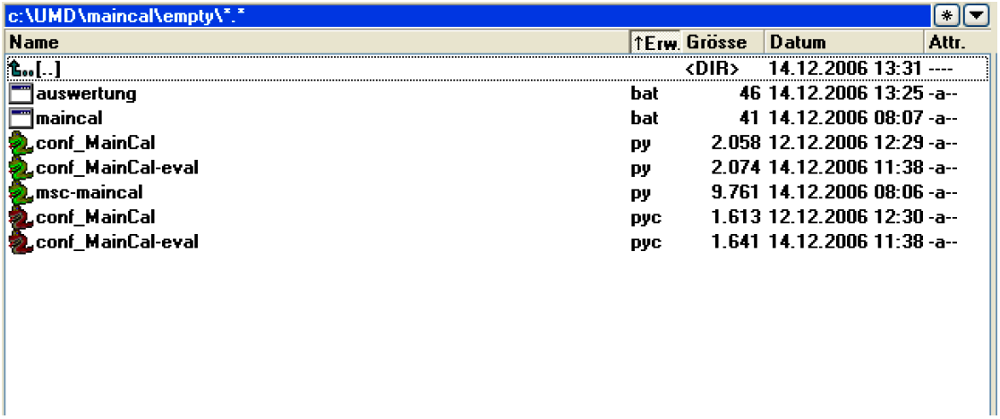
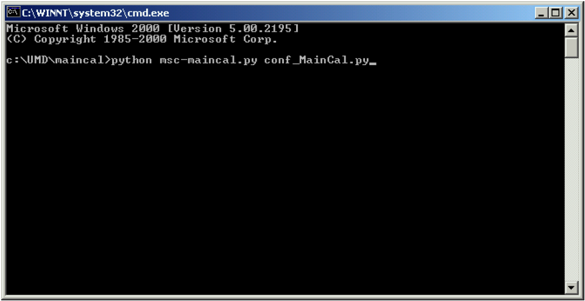
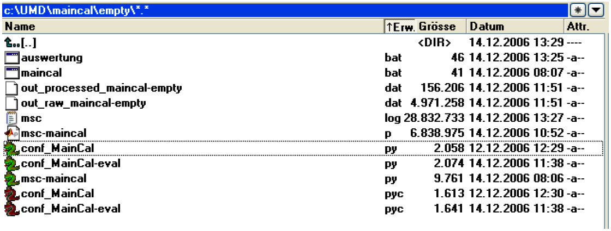
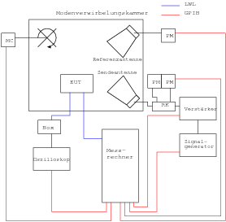
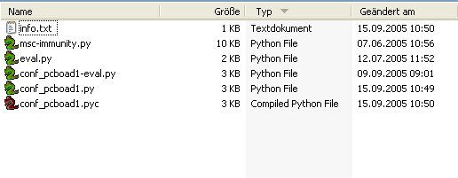
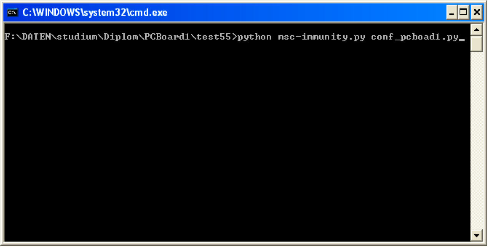
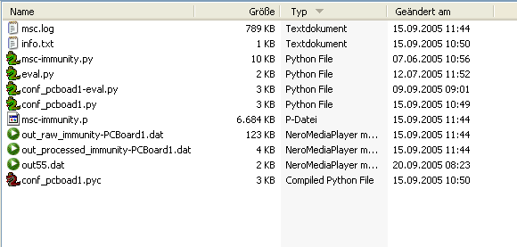

.. -*-coding: utf-8 -*-

Hinweise zur Durchführung von Messungen in Modenverwirbelungskammern
=====================================================================

Allgemeines
-----------

Alle Programmroutinen, die zur Steuerung der Geräte oder zum Erfassen
und Auswerten von Messdaten erforderlich sind, sind in der
entwickelten Software integriert. Diese wurde in der
Programmiersprache Python (http://www.python.org/) geschrieben. 

In die hinterlegten Geräteklassen
können jederzeit neue Geräte integriert werden, falls einmal der
Messaufbau erweitert werden sollte. Somit wird für die einzelnen
Messungen jeweils nur ein relativ kurzes Programm benötigt, welches
die jeweils notwendigen Routinen aufruft. Diesem Programm wird als
Parameter beim Aufruf eine kleine Konfigurationsdatei, die ebenfalls in
Python geschrieben wurde, übergeben. Diese Konfigurationsdatei wird für
jede einzelne Messung benötigt. Der Name der Kondfigurationsdatei
beginnt aus Übersichtsgründen mit `conf_`. In ihr sind alle für die
Messung notwendigen Parameter, wie Messbereich, Schrittweite oder die
Anzahl der zu untersuchenden Tunerpositionen enthalten, die dann
während der einzelnen Funktionsaufrufe jeweils an die Routinen
übergeben werden. 

Bei Störfestigkeitsmessungen ist es sinnvoll (wenn es mit
nicht allzu großem Aufwand realisierbar ist) eine
automatische Prüflingsüberwachung im Programmablauf zu integrieren. 

Es
empfiehlt sich, für jede einzelne Messung einen seperaten Ordner
anzulegen. Dieser Ordner muss das gewünschte Messprogramm sowie die
Kofigurationsdatei enthalten, Weiterhin kann eine `.dot` Datei in diesem
Ordner abgelegt werden, in der der Messaufbau definiert wird und auf
die noch näher eingegangen wird. Werden Messserien aufgenommen, bei
denen sich der Messaufbau nicht ändert, kann die `.dot` Datei auch
zentral abgelegt werden und der Pfad in der Konfigurationsdatei
entsprechend angepasst werden (mehr dazu später im Beispiel). In
diesen Ordner werden während der Messungen auch die Ergebnisse und
andere Dateien gespeichert, auf die später noch näher eingegangen
wird. 

Die übrigen Programmroutinen, Gerätetreiber und die
Initialisierungsdateien müssen nicht mit kopiert werden, da die Pfade
zu deren Speicherorten als globale Variablen hinterlegt sind. Somit
hat man abschließend für jede Messung seperate Ordner mit allen für
diese Messung relevanten Daten.

Zunächst wird ebenfalls durch das aufrufende Messprogramm eine Instanz
der Klasse :class:`MSC` erzeugt. Diese wird entweder neu oder aus bereits
vorhanden Sicherungsdateien (`pickle` files) erstellt. Die :class:`MSC` Klasse ist für die
Kommunikation mit den Messgeräten, die Messung und die Auswertung der
Messdaten zuständig. 

Dieser Instanz werden die Messparameter
`measurement_parameters` und Auswerteparameter `evaluation_parameters`
übergeben und sie führt dann die entsprechenden Befehle oder
Messroutinen durch, legt Autosavedateien an und gibt
nach erfolgter Messung die Rohdaten und nach beendeter Auswertung die
ausgewerteten Daten aus. 

Den Aufbau der Messung, also die verwendeten
Geräte und die Signalwege, erhält die Klasse durch Auswertung der
`.dot` Datei. 

Anschließend wird der gesamte Stand der abgeschlossenen
Messungen in einem `pickle` file gespeichert. Das Pickling stellt einen
sehr hilfreichen und nützlichen Algorithmus dar, mit dem sich
strukturierte Datenobjekte zu einer Bytefolge "serialisieren" und dann
in einer Datei abspeichern lassen. Diese Datei lässt sich später
wieder laden und zur ursprünglichen Datenstruktur zurückwandeln. Dies
ist nützlich, um beispielsweise an bestimmten Stellen das Messprogramm
anzuhalten und den momentanen Zustand sozusagen "einzufrieren" und
später mit weiteren Messungen fortsetzen zu können mit dem Vorteil,
dass alle vorherigen Operationen und Befehle immer noch protokolliert
und nachvollziehbar sind, da die Instanz der Klasse ja immer noch
besteht.

Der Messgraph
^^^^^^^^^^^^^^

Vor Beginn der Messungen muss der Messaufbau definiert werden. Diese
Daten benötigt die Messsoftware, um die aufgenommenen Daten auswerten
zu können. Die Beschreibung des Messaufbaus erfolgt mit Hilfe eines
Graphen. In einer Datei mit der Endung `.dot` ist der Messaufbau in
Textform hinterlegt. Ein Beispiel für eine solche `.dot` Datei ist::

    digraph {
            node [fontsize=12];
            graph [fontsize=12];
            edge [fontsize=10];
            rankdir=LR;

            cbl_sg_amp [ini="M:\\umd-config\\smallMSC\\ini\\cbl_sg_amp.ini" condition="10e6 <= f <= 18e9"] [color=white, fontcolor=white ]
            cbl_amp_ant [ini="M:\\umd-config\\smallMSC\\ini\\cbl_amp_ant.ini" condition="10e6 <= f <= 4.2e9"] [color=white, fontcolor=white ]
            cbl_amp_pm1 [ini="M:\\umd-config\\smallMSC\\ini\\cbl_amp_pm1.ini" condition="10e6 <= f <= 4.2e9"] [color=white, fontcolor=white ]
            sg  [ini="M:\\umd-config\\smallMSC\\ini\\umd-gt-12000A-real.ini"] [style=filled,color=lightgrey]
            amp  [ini="M:\\umd-config\\smallMSC\\ini\\umd-ar-100s1g4-3dB-real-remote.ini" condition="800e6 <= f <= 4.2e9"] 
            ant  [ini="M:\\umd-config\\smallMSC\\ini\\umd-rs-HF906_04.ini"] [style=filled,color=lightgrey]
            refant  [ini="M:\\umd-config\\smallMSC\\ini\\umd-rs-HF906_03.ini"] [style=filled,color=lightgrey]
            tuner [ini="M:\\umd-config\\smallMSC\\ini\\umd-sms60-real.ini" ch=1] [style=filled,color=lightgrey]
            pmref [ini="M:\\umd-config\\smallMSC\\ini\\umd-rs-nrvd-2-real.ini" ch=2] [style=filled,color=lightgrey]
            pm1  [ini="M:\\umd-config\\smallMSC\\ini\\umd-rs-nrvd-1-real.ini" ch=1] [style=filled,color=lightgrey]
            pm2  [ini="M:\\umd-config\\smallMSC\\ini\\umd-rs-nrvd-1-real.ini" ch=2] [style=filled,color=lightgrey]
            cbl_ant_pm2 [ini="M:\\umd-config\\smallMSC\\ini\\cbl_ant_pm2.ini" condition="10e6 <= f <= 4.2e9"] [color=white, fontcolor=white ]
            cbl_r_pmr [ini="M:\\umd-config\\smallMSC\\ini\\cbl_r_pmr.ini" condition="10e6 <= f <= 18e9"] [color=white, fontcolor=white ]
            att20 [ini="M:\\umd-config\\smallMSC\\ini\\att20-50W.ini" condition="10e6 <= f <= 18e9"] [color=white, fontcolor=white ]
            a1 [style=filled,color=lightgrey]
            a2 [style=filled,color=lightgrey]

            subgraph cluster_amp {
                    label=amp
                    amp_in -> amp_out [dev=amp what="S21"]
            }

            sg -> a1 [dev=cbl_sg_amp what="S21"] [label="cbl_sg_amp"]
            a1 -> amp_in
            amp_out -> a2
            a2 -> ant [dev=cbl_amp_ant what="S21"]  [label="cbl_amp_ant"]
            a2 -> pm1 [dev=cbl_amp_pm1 what="S21"]  [label="cbl_amp_pm1"]
            refant -> feedthru [dev=cbl_r_pmr what="S21"]  [label="cbl_r_pmr"]
            feedthru -> pmref [dev=att20 what="S21"]  [label="att20"]
            ant -> pm2 [dev=cbl_ant_pm2 what="S21"]  [label="cbl_ant_pm2"]

            subgraph "cluster_msc" {label=MSC; ant; refant}

            subgraph "cluster_pmoutput" {label="output"; pm1; pm2; pmref;}
            }

.. graphviz::

   digraph {
            node [fontsize=12];
            graph [fontsize=12];
            edge [fontsize=10];
            rankdir=LR;

            cbl_sg_amp [ini="M:\\umd-config\\smallMSC\\ini\\cbl_sg_amp.ini" condition="10e6 <= f <= 18e9"] [color=white, fontcolor=white ]
            cbl_amp_ant [ini="M:\\umd-config\\smallMSC\\ini\\cbl_amp_ant.ini" condition="10e6 <= f <= 4.2e9"] [color=white, fontcolor=white ]
            cbl_amp_pm1 [ini="M:\\umd-config\\smallMSC\\ini\\cbl_amp_pm1.ini" condition="10e6 <= f <= 4.2e9"] [color=white, fontcolor=white ]
            sg  [ini="M:\\umd-config\\smallMSC\\ini\\umd-gt-12000A-real.ini"] [style=filled,color=lightgrey]
            amp  [ini="M:\\umd-config\\smallMSC\\ini\\umd-ar-100s1g4-3dB-real-remote.ini" condition="800e6 <= f <= 4.2e9"] 
            ant  [ini="M:\\umd-config\\smallMSC\\ini\\umd-rs-HF906_04.ini"] [style=filled,color=lightgrey]
            refant  [ini="M:\\umd-config\\smallMSC\\ini\\umd-rs-HF906_03.ini"] [style=filled,color=lightgrey]
            tuner [ini="M:\\umd-config\\smallMSC\\ini\\umd-sms60-real.ini" ch=1] [style=filled,color=lightgrey]
            pmref [ini="M:\\umd-config\\smallMSC\\ini\\umd-rs-nrvd-2-real.ini" ch=2] [style=filled,color=lightgrey]
            pm1  [ini="M:\\umd-config\\smallMSC\\ini\\umd-rs-nrvd-1-real.ini" ch=1] [style=filled,color=lightgrey]
            pm2  [ini="M:\\umd-config\\smallMSC\\ini\\umd-rs-nrvd-1-real.ini" ch=2] [style=filled,color=lightgrey]
            cbl_ant_pm2 [ini="M:\\umd-config\\smallMSC\\ini\\cbl_ant_pm2.ini" condition="10e6 <= f <= 4.2e9"] [color=white, fontcolor=white ]
            cbl_r_pmr [ini="M:\\umd-config\\smallMSC\\ini\\cbl_r_pmr.ini" condition="10e6 <= f <= 18e9"] [color=white, fontcolor=white ]
            att20 [ini="M:\\umd-config\\smallMSC\\ini\\att20-50W.ini" condition="10e6 <= f <= 18e9"] [color=white, fontcolor=white ]
            a1 [style=filled,color=lightgrey]
            a2 [style=filled,color=lightgrey]

            subgraph cluster_amp {
                    label=amp
                    amp_in -> amp_out [dev=amp what="S21"]
            }

            sg -> a1 [dev=cbl_sg_amp what="S21"] [label="cbl_sg_amp"]
            a1 -> amp_in
            amp_out -> a2
            a2 -> ant [dev=cbl_amp_ant what="S21"]  [label="cbl_amp_ant"]
            a2 -> pm1 [dev=cbl_amp_pm1 what="S21"]  [label="cbl_amp_pm1"]
            refant -> feedthru [dev=cbl_r_pmr what="S21"]  [label="cbl_r_pmr"]
            feedthru -> pmref [dev=att20 what="S21"]  [label="att20"]
            ant -> pm2 [dev=cbl_ant_pm2 what="S21"]  [label="cbl_ant_pm2"]

            subgraph "cluster_msc" {label=MSC; ant; refant}

            subgraph "cluster_pmoutput" {label="output"; pm1; pm2; pmref;}
            }

Als Beschreibungssprache für den Graphen wird DOT-language
benutzt. Weitere Informationen zu dieser Spache sind unter
http://www.graphviz.org/ zu finden.

Nach einigen globalen (optionalen) Anweisungen zur Graphenvisualisierung werden
zunächst alle verwendeten Geräte und Kabel aufgelistet und somit als
Knoten im Graphen definiert. 

In unserem Beispielfall finden also ein
Signalgenerator (`sg`), diverse Kabel (`cbl`), ein Abschwächer (`att`), ein
Verstärker (`amp`), eine Sende- und eine Referenzantenne (`ant`), der
Rührer (`tuner`) und einige Leistungsmesser (`pm`) Anwendung. 

Die Kabel
und der Abschwächer, die eigentlich als Verbindungen, also als Kanten
im Graphen fungieren, wurden hier ebenfalls als Knoten deklariert, da
dies die spätere Parameterübergabe an das Messprogramm erleichtert. 

In
den ersten eckigen Klammern hinter den Geräten werden diese für die
Messung relevanten Parameter der entsprechenden Geräte übergeben. Als
Parameter wird auf jeden Fall der Dateiname der Initialisierungsdatei des Geräts benötigt. 
Dies ist eine
Textdatei mit der Endung `.ini`, in der alle wichtigen Informationen
über das entsprechende Gerät hinterlegt sind. 

Weitere mögliche
Parameter sind zum Beispiel der Arbeitsbereich der Geräte, die als
`condition` definiert werden. Weiterhin ist es möglich, beim Erreichen
dieser `condition` bestimmte Aktionen, die als `action` definiert werden,
auszuführen. 

In den zweiten eckigen Klammern sind Attribute zur
Visualisierung des Graphen zu finden. 

Anschließend beginnt die
eigentliche Beschreibung des Messaufbaus. Hierbei wird definiert, wie
und in welche Richtungen die einzelnen Geräte (Knoten) miteinander
verbunden sind. Abbildung 1.1 stellt den im `.dot` file beschriebenen
Aufbau noch einmal grafisch dar. Zur Visualisierung des `.dot` files wurde
das Programm :program:`Graphviz` benutzt, das sich ebenfalls auf
der oben angegebenen Homepage herunterladen lässt. 

Bei der Darstellung wurden allerdings aus Gründen der Übersichtlichkeit alle Knoten, die die 
Verbindungen repräsentieren, also keine wirklichen Knoten sind, ausgeblendet.

Bei jeder Art von Messungen gibt es bestimmte Knoten, die auf alle Fälle im Messaufbau enthalten sein müssen. 
Diese sind hier grau markiert. Dieser Aufbau findet bei Störemissions- und Störfestigkeitsmessungen Anwendung. 
Als weiteres Beispiel sei noch ein typischer Aufbau für die Kalibrierung einer Modenverwirbelungskammer angefügt::

   digraph {
            node [fontsize=12];
            graph [fontsize=12];
            edge [fontsize=10];
            rankdir=LR;

            sg  [ ini="M:\\umd-config\\largeMSC\\ini\\umd-rs-smr-real.ini"  ] [style=filled,color=lightgrey]
            fp1 [ini="M:\\umd-config\\largeMSC\\ini\\umd-narda-emc300-1-real.ini"] [style=filled,color=lightgrey]
            fp2 [ini="M:\\umd-config\\largeMSC\\ini\\umd-narda-emc300-2-real.ini"] [style=filled,color=lightgrey]
            fp3 [ini="M:\\umd-config\\largeMSC\\ini\\umd-narda-emc300-3-real.ini"] [style=filled,color=lightgrey]
            fp4 [ini="M:\\umd-config\\largeMSC\\ini\\umd-narda-emc300-4-real.ini"] [style=filled,color=lightgrey]
            fp5 [ini="M:\\umd-config\\largeMSC\\ini\\umd-narda-emc300-5-real.ini"] [style=filled,color=lightgrey]
            fp6 [ini="M:\\umd-config\\largeMSC\\ini\\umd-narda-emc300-6-real.ini"] [style=filled,color=lightgrey]
            fp7 [ini="M:\\umd-config\\largeMSC\\ini\\umd-narda-emc300-7-real.ini"] [style=filled,color=lightgrey]
            fp8 [ini="M:\\umd-config\\largeMSC\\ini\\umd-narda-emc300-8-real.ini"] [style=filled,color=lightgrey]
            tuner1 [ini="M:\\umd-config\\largeMSC\\ini\\umd-mc-hd-100-real.ini" ch=2] [style=filled,color=lightgrey]
            ant1  [ini="M:\\umd-config\\largeMSC\\ini\\umd-sb-VULP9118-C_513.ini" condition="f <= 1e9" ]
            ant2  [ini="M:\\umd-config\\largeMSC\\ini\\umd-rs-HF906_04.ini" condition="f > 1e9" ]
            refant [style=filled,color=lightgrey]
            refant1  [ini="M:\\umd-config\\largeMSC\\ini\\umd-sb-VULP9118-C_514.ini" condition="f <= 1e9" ]
            refant2  [ini="M:\\umd-config\\largeMSC\\ini\\umd-rs-HF906_03.ini" condition="f > 1e9" ]
            pmref1  [ini="M:\\umd-config\\largeMSC\\ini\\umd-rs-nrvs-real.ini" ch=1] [style=filled,color=lightgrey]
            pm2  [ini="M:\\umd-config\\largeMSC\\ini\\umd-rs-nrvd-real.ini" ch=2] [style=filled,color=lightgrey]
            pm1  [ini="M:\\umd-config\\largeMSC\\ini\\umd-rs-nrvd-real.ini" ch=1] [style=filled,color=lightgrey]
            sw [ini="M:\\umd-config\\largeMSC\\ini\\umd-umd-sb-real.ini" ch=1]
            sta [ini="M:\\umd-config\\largeMSC\\ini\\umd-umd-sb-real.ini" ch=2]
            amp1  [ini="M:\\umd-config\\largeMSC\\ini\\amplifier1.ini" condition="f <= 1e9" action="import custom\ncustom.my_switch(self.sw, 'f', 1e9)"]
            amp2  [ini="M:\\umd-config\\largeMSC\\ini\\amplifier2.ini" condition="f > 1e9"  action="import custom\ncustom.my_switch(self.sw, 'f', 1e9)"]
            a1 [style=filled,color=lightgrey]
            a2 [style=filled,color=lightgrey]
            ant [style=filled,color=lightgrey]
            cbl_r1_pmr [ini="M:\\umd-config\\largeMSC\\ini\\umd-cable-PM-Ref-Ant_LF-10db.ini" condition="f <= 360e6" action="import custom\ncustom.my_switch(self.sta, 'f', 360e6)"] [color=white, fontcolor=white ]
            cbl_r2_pmr [ini="M:\\umd-config\\largeMSC\\ini\\umd-cable-PM-Ref-Ant_LF-0db.ini" condition="360e6 < f <= 1e9"action="import custom\ncustom.my_switch(self.sta, 'f', 360e6)"] [color=white, fontcolor=white ]
            cbl_r3_pmr [ini="M:\\umd-config\\largeMSC\\ini\\umd-cable-PM-Ref-Ant_HF-0db.ini" condition="f > 1e9"] [color=white, fontcolor=white ]
            cbl_sg_amp1 [ini="M:\\umd-config\\largeMSC\\ini\\umd-cable-SG-AMP_LF.ini" condition="f <= 1e9"] [color=white, fontcolor=white ]
            cbl_sg_amp2 [ini="M:\\umd-config\\largeMSC\\ini\\umd-cable-SG-AMP_HF.ini" condition="f > 1e9"] [color=white, fontcolor=white ]
            cbl_amp1_ant1 [ini="M:\\umd-config\\largeMSC\\ini\\umd-cable-AMP-ANT_LF.ini" condition="f <= 1e9"] [color=white, fontcolor=white ]
            cbl_amp2_ant2 [ini="M:\\umd-config\\largeMSC\\ini\\umd-cable-AMP-ANT_HF.ini" condition="f > 1e9"] [color=white, fontcolor=white ]
            cbl_amp1_pm1 [ini="M:\\umd-config\\largeMSC\\ini\\umd-cable-PM-FWD_LF.ini" condition="f <= 1e9"] [color=white, fontcolor=white ]
            cbl_amp2_pm1 [ini="M:\\umd-config\\largeMSC\\ini\\umd-cable-PM-FWD_HF.ini" condition="f > 1e9"] [color=white, fontcolor=white ]
            cbl_ant1_pm2 [ini="M:\\umd-config\\largeMSC\\ini\\umd-cable-PM-REV_LF.ini" condition="f <= 1e9"] [color=white, fontcolor=white ]
            cbl_ant2_pm2 [ini="M:\\umd-config\\largeMSC\\ini\\umd-cable-PM-REV_HF.ini" condition="f > 1e9"] [color=white, fontcolor=white ]

            subgraph cluster_amp1 {
                label=amp1
                a1_a1 -> a2_e1 [dev=amp1 what="S21"]
            }
            subgraph cluster_amp2 {
                label=amp2
                a1_a2 -> a2_e2 [dev=amp2 what="S21"]
            }

            subgraph cluster_pm_in {label=pm_in; pm1_e1; pm1_e2; pm2_e1; pm2_e2; pmref1_e1; pmref1_e2; pmref1_e3}

            subgraph cluster_msc {label=MSC; tuner1; ant; ant_a1; ant_a2; ant_e1; ant_e2; ant1; ant2; refant; refant1; refant2; refant_a1; refant_a2; refant_a3}

            subgraph cluster_pmoutput {label=output; pm1; pm2 ;pmref1;}

            sg -> sg_a1
            sg -> sg_a2
            sg_a1 -> a1_e1 [dev=cbl_sg_amp1 what="S21"] [label=cbl_sg_amp1]
            sg_a2 -> a1_e2 [dev=cbl_sg_amp2 what="S21"] [label=cbl_sg_amp2]
            a1_e1 -> a1
            a1_e2 -> a1
            a1 -> a1_a1
            a1 -> a1_a2
            a2_e1 -> a2
            a2_e2 -> a2
            a2 -> a2_a1
            a2 -> a2_a2
            a2_a1 -> ant_e1 [dev=cbl_amp1_ant1 what="S21"] [label=cbl_amp1_ant1]
            a2_a2 -> ant_e2 [dev=cbl_amp2_ant2 what="S21"] [label=cbl_amp2_ant2]
            ant_e1 -> ant
            ant_e2 -> ant
            ant -> ant1 
            ant1 -> ant 
            ant -> ant2 
            ant2 -> ant 
            ant -> ant_a1
            ant -> ant_a2
            a2_a1 -> pm1_e1 [dev=cbl_amp1_pm1 what="S21"] [label=cbl_amp1_pm1]
            a2_a2 -> pm1_e2 [dev=cbl_amp2_pm1 what="S21"] [label=cbl_amp2_pm1]
            pm1_e1 -> pm1
            pm1_e2 -> pm1
            ant_a1 -> pm2_e1 [dev=cbl_ant1_pm2 what="S21"] [label=cbl_ant1_pm2]
            ant_a2 -> pm2_e2 [dev=cbl_ant2_pm2 what="S21"] [label=cbl_ant2_pm2]
            pm2_e1 -> pm2
            pm2_e2 -> pm2
            refant1 -> refant
            refant2 -> refant
            refant -> refant_a1
            refant -> refant_a2
            refant -> refant_a3
            refant_a3 -> pmref1_e3  [dev=cbl_r3_pmr what="S21"] [label=cbl_r3_pmr]
            refant_a2 -> pmref1_e2  [dev=cbl_r2_pmr what="S21"] [label=cbl_r2_pmr]
            refant_a1 -> pmref1_e1 [dev=cbl_r1_pmr what="S21"] [label=cbl_r1_pmr]
            pmref1_e1 -> pmref1
            pmref1_e2 -> pmref1
            pmref1_e3 -> pmref1	
           }

.. _dot-kalibrieraufbau:

.. graphviz::

   digraph {
            node [fontsize=12];
            graph [fontsize=12];
            edge [fontsize=10];
            rankdir=LR;

            sg  [ ini="M:\\umd-config\\largeMSC\\ini\\umd-rs-smr-real.ini"  ] [style=filled,color=lightgrey]
            fp1 [ini="M:\\umd-config\\largeMSC\\ini\\umd-narda-emc300-1-real.ini"] [style=filled,color=lightgrey]
            fp2 [ini="M:\\umd-config\\largeMSC\\ini\\umd-narda-emc300-2-real.ini"] [style=filled,color=lightgrey]
            fp3 [ini="M:\\umd-config\\largeMSC\\ini\\umd-narda-emc300-3-real.ini"] [style=filled,color=lightgrey]
            fp4 [ini="M:\\umd-config\\largeMSC\\ini\\umd-narda-emc300-4-real.ini"] [style=filled,color=lightgrey]
            fp5 [ini="M:\\umd-config\\largeMSC\\ini\\umd-narda-emc300-5-real.ini"] [style=filled,color=lightgrey]
            fp6 [ini="M:\\umd-config\\largeMSC\\ini\\umd-narda-emc300-6-real.ini"] [style=filled,color=lightgrey]
            fp7 [ini="M:\\umd-config\\largeMSC\\ini\\umd-narda-emc300-7-real.ini"] [style=filled,color=lightgrey]
            fp8 [ini="M:\\umd-config\\largeMSC\\ini\\umd-narda-emc300-8-real.ini"] [style=filled,color=lightgrey]
            tuner1 [ini="M:\\umd-config\\largeMSC\\ini\\umd-mc-hd-100-real.ini" ch=2] [style=filled,color=lightgrey]
            ant1  [ini="M:\\umd-config\\largeMSC\\ini\\umd-sb-VULP9118-C_513.ini" condition="f <= 1e9" ]
            ant2  [ini="M:\\umd-config\\largeMSC\\ini\\umd-rs-HF906_04.ini" condition="f > 1e9" ]
            refant [style=filled,color=lightgrey]
            refant1  [ini="M:\\umd-config\\largeMSC\\ini\\umd-sb-VULP9118-C_514.ini" condition="f <= 1e9" ]
            refant2  [ini="M:\\umd-config\\largeMSC\\ini\\umd-rs-HF906_03.ini" condition="f > 1e9" ]
            pmref1  [ini="M:\\umd-config\\largeMSC\\ini\\umd-rs-nrvs-real.ini" ch=1] [style=filled,color=lightgrey]
            pm2  [ini="M:\\umd-config\\largeMSC\\ini\\umd-rs-nrvd-real.ini" ch=2] [style=filled,color=lightgrey]
            pm1  [ini="M:\\umd-config\\largeMSC\\ini\\umd-rs-nrvd-real.ini" ch=1] [style=filled,color=lightgrey]
            sw [ini="M:\\umd-config\\largeMSC\\ini\\umd-umd-sb-real.ini" ch=1]
            sta [ini="M:\\umd-config\\largeMSC\\ini\\umd-umd-sb-real.ini" ch=2]
            amp1  [ini="M:\\umd-config\\largeMSC\\ini\\amplifier1.ini" condition="f <= 1e9" action="import custom\ncustom.my_switch(self.sw, 'f', 1e9)"]
            amp2  [ini="M:\\umd-config\\largeMSC\\ini\\amplifier2.ini" condition="f > 1e9"  action="import custom\ncustom.my_switch(self.sw, 'f', 1e9)"]
            a1 [style=filled,color=lightgrey]
            a2 [style=filled,color=lightgrey]
            ant [style=filled,color=lightgrey]
            cbl_r1_pmr [ini="M:\\umd-config\\largeMSC\\ini\\umd-cable-PM-Ref-Ant_LF-10db.ini" condition="f <= 360e6" action="import custom\ncustom.my_switch(self.sta, 'f', 360e6)"] [color=white, fontcolor=white ]
            cbl_r2_pmr [ini="M:\\umd-config\\largeMSC\\ini\\umd-cable-PM-Ref-Ant_LF-0db.ini" condition="360e6 < f <= 1e9"action="import custom\ncustom.my_switch(self.sta, 'f', 360e6)"] [color=white, fontcolor=white ]
            cbl_r3_pmr [ini="M:\\umd-config\\largeMSC\\ini\\umd-cable-PM-Ref-Ant_HF-0db.ini" condition="f > 1e9"] [color=white, fontcolor=white ]
            cbl_sg_amp1 [ini="M:\\umd-config\\largeMSC\\ini\\umd-cable-SG-AMP_LF.ini" condition="f <= 1e9"] [color=white, fontcolor=white ]
            cbl_sg_amp2 [ini="M:\\umd-config\\largeMSC\\ini\\umd-cable-SG-AMP_HF.ini" condition="f > 1e9"] [color=white, fontcolor=white ]
            cbl_amp1_ant1 [ini="M:\\umd-config\\largeMSC\\ini\\umd-cable-AMP-ANT_LF.ini" condition="f <= 1e9"] [color=white, fontcolor=white ]
            cbl_amp2_ant2 [ini="M:\\umd-config\\largeMSC\\ini\\umd-cable-AMP-ANT_HF.ini" condition="f > 1e9"] [color=white, fontcolor=white ]
            cbl_amp1_pm1 [ini="M:\\umd-config\\largeMSC\\ini\\umd-cable-PM-FWD_LF.ini" condition="f <= 1e9"] [color=white, fontcolor=white ]
            cbl_amp2_pm1 [ini="M:\\umd-config\\largeMSC\\ini\\umd-cable-PM-FWD_HF.ini" condition="f > 1e9"] [color=white, fontcolor=white ]
            cbl_ant1_pm2 [ini="M:\\umd-config\\largeMSC\\ini\\umd-cable-PM-REV_LF.ini" condition="f <= 1e9"] [color=white, fontcolor=white ]
            cbl_ant2_pm2 [ini="M:\\umd-config\\largeMSC\\ini\\umd-cable-PM-REV_HF.ini" condition="f > 1e9"] [color=white, fontcolor=white ]

            subgraph cluster_amp1 {
                label=amp1
                a1_a1 -> a2_e1 [dev=amp1 what="S21"]
            }
            subgraph cluster_amp2 {
                label=amp2
                a1_a2 -> a2_e2 [dev=amp2 what="S21"]
            }

            subgraph cluster_pm_in {label=pm_in; pm1_e1; pm1_e2; pm2_e1; pm2_e2; pmref1_e1; pmref1_e2; pmref1_e3}

            subgraph cluster_msc {label=MSC; tuner1; ant; ant_a1; ant_a2; ant_e1; ant_e2; ant1; ant2; refant; refant1; refant2; refant_a1; refant_a2; refant_a3}

            subgraph cluster_pmoutput {label=output; pm1; pm2 ;pmref1;}

            sg -> sg_a1
            sg -> sg_a2
            sg_a1 -> a1_e1 [dev=cbl_sg_amp1 what="S21"] [label=cbl_sg_amp1]
            sg_a2 -> a1_e2 [dev=cbl_sg_amp2 what="S21"] [label=cbl_sg_amp2]
            a1_e1 -> a1
            a1_e2 -> a1
            a1 -> a1_a1
            a1 -> a1_a2
            a2_e1 -> a2
            a2_e2 -> a2
            a2 -> a2_a1
            a2 -> a2_a2
            a2_a1 -> ant_e1 [dev=cbl_amp1_ant1 what="S21"] [label=cbl_amp1_ant1]
            a2_a2 -> ant_e2 [dev=cbl_amp2_ant2 what="S21"] [label=cbl_amp2_ant2]
            ant_e1 -> ant
            ant_e2 -> ant
            ant -> ant1 
            ant1 -> ant 
            ant -> ant2 
            ant2 -> ant 
            ant -> ant_a1
            ant -> ant_a2
            a2_a1 -> pm1_e1 [dev=cbl_amp1_pm1 what="S21"] [label=cbl_amp1_pm1]
            a2_a2 -> pm1_e2 [dev=cbl_amp2_pm1 what="S21"] [label=cbl_amp2_pm1]
            pm1_e1 -> pm1
            pm1_e2 -> pm1
            ant_a1 -> pm2_e1 [dev=cbl_ant1_pm2 what="S21"] [label=cbl_ant1_pm2]
            ant_a2 -> pm2_e2 [dev=cbl_ant2_pm2 what="S21"] [label=cbl_ant2_pm2]
            pm2_e1 -> pm2
            pm2_e2 -> pm2
            refant1 -> refant
            refant2 -> refant
            refant -> refant_a1
            refant -> refant_a2
            refant -> refant_a3
            refant_a3 -> pmref1_e3  [dev=cbl_r3_pmr what="S21"] [label=cbl_r3_pmr]
            refant_a2 -> pmref1_e2  [dev=cbl_r2_pmr what="S21"] [label=cbl_r2_pmr]
            refant_a1 -> pmref1_e1 [dev=cbl_r1_pmr what="S21"] [label=cbl_r1_pmr]
            pmref1_e1 -> pmref1
            pmref1_e2 -> pmref1
            pmref1_e3 -> pmref1	
           }
   

In Abbildung :ref:`dot-kalibrieraufbau` ist der entsprechende Aufbau zu sehen. 

Hier sind zusätzlich noch die für die Kalibrierung notwendigen 8
Feldsonden zu sehen. Weiterhin werden in dieser MVK auf Grund
ihres Arbeitsbereiches je nach Frequenzbereich unterschiedliche
Antennen und Verstärker benutzt, zwischen denen entsprechend im
Programmablauf hin- und hergeschaltet wird. 

Auch hier markieren die
grauen Knoten wieder die bei einer Kalibrierung unbedingt
erforderlichen Knoten. Hier ist bei den Verstärkern und Kabeln zu
sehen, dass beim Erreichen von 360 MHz bzw. 1 GHz, dies ist als
*condition* festgelegt, eine *action* auszuführen ist. Dies ist in diesem
Fall das Umschalten des Signalpfades. Zum einen wird bei Frequenzen
unterhalb von 360 MHz ein Abschwächer im Signalpfad benutzt, der dann
auf einem anderen Signalpfad umgangen wird. Zum anderen werden bei
Messungen oberhalb von 1 GHz andere Antennen und Verstärker benutzt,
so dass auch beim Erreichen dieser Frequenz der Signalpfad geändert
werden muss. Das Umschalten der Pfade wird programmgesteuert über die
Umschalter *sta* und *sw* realisiert.

Die Initialisierungsdatei
^^^^^^^^^^^^^^^^^^^^^^^^^^

Wie bereits erwähnt, ist die `.ini` Datei die Datei, in der alle
Startattribute für die einzelnen Geräte festgelegt sind. Wenn dem
aufrufenden Messprogramm keine anderen Attribute übergeben werden,
werden die Geräte mit den in der .ini-Datei festgelegten Parametern
initialisiert. Im nächsten Listing ist als Beispiel die
Initialisierungsdatei für den Signalgenerator `SMT06` der Firma R&S zu
sehen. Anhand dieser noch recht übersichtlichen Datei soll kurz auf
deren Aufbau eingegangen werden::

   [description]
   DESCRIPTION = "Rohde&Schwarz SMT20 Signal Generator"
   TYPE = "SIGNALGENERATOR"
   VENDOR ="Rohde&Schwarz"
   SERIALNR = ""
   DEVICEID = ""
   DRIVER = "M:\\dlls\\umd-rs-smt.dll"
   NR_OF_CHANNELS = "1"

   [INIT_VALUE]
   FSTART = "5e3"
   FSTOP = "6e9"
   FSTEP = "1.0"
   GPIB = "28"
   VIRTUAL = "1"

   [CHANNEL_1]
   NAME = "RF Out"
   LEVEL = "-100"
   UNIT = "dBm"
   LEVELOFFSET = "0.0"
   LEVELLIMIT = "0.0"
   OUTPUTSTATE = "0"
   LFOUTPUTSTATE = "0"
   ATTMODE = "0"
   OPERATINGMODE = "0"

Die `.ini` Datei enthält eine Reihe von für diese Gerätefamilie
nötigen Keys mit entsprechenden Werten. 

Die ersten Blöcke sind für
alle Geräte gleich. Im ersten, allgemeinen, Block wird der Name, Typ
und Hersteller festgehalten. Falls bekannt, kann in diesem Block auch
die Seriennummer und ID des Gerätes festgehalten werden. Letzlich wird
der Speicherort des Treibers für das Gerät und die Anzahl der
möglichen Kanäle des Gerätes übergeben. Im zweiten Block werden Start-
und Stopfrequenz, die Schrittweite, die GPIB-Adresse und die
Betriebsart übergeben. Zum Schluss folgt für jeden nutzbaren Kanal des
Gerätes ein Block, in dem die für dieses Gerät typischen
Einstellmöglichkeiten mit Startwerten belegt werden, damit beim
Initialisieren der Geräte keine undefinierten Zustände entstehen oder
Einstellungen von alten Messungen beibehalten werden, die evtl. den
aktuellen Messaufbau zum Beispiel durch zu hohe Feldstärken gefährden.

Kalibriermessungen
-------------------

Der Ablauf einer typischen Kalibriermessung soll am Beispiel der Kalibrierung einer leeren Modenverwirbelungskammer erläutert werden. Wie bereits angesprochen, ist es günstiger, für jede Messung einen gesonderten Ordner zu benutzen, um in diesem alle Daten zu speichern. In dieses Ordner gehören jeweils die Konfigurationsdatei, das aufrufende Messprogramm und evtl. die entsprechende .dot-Datei. In der fogenden Abbildung  ist ein Beispiel für den Inhalt eines Messordners zu sehen. Zusätzlich befindet sich im Ordner noch eine zweite Konfigurationsdatei für die Auswertung und zwei Batchdateien, mit denen die Messung oder Auswertung auch gestartet werden kann.

   Messordnerinhalt vor Beginn der Messungen

Vorbereitungen
^^^^^^^^^^^^^^^

Die dot-Datei
"""""""""""""

Die `.dot` Datei wurde in diesem Fall im globalen Verzeichnis der `.dot` Dateien hinterlegt. 

Sie ist im folgendem Listing dargestellt::

   digraph {node [fontsize=12];
            graph [fontsize=12]; 
            edge [fontsize=10]; 
            rankdir=LR;

            sg [ini="C:\\UMD\\umd−config\\ini\\rs−smg.ini"] [style=filled, color=lightgrey]
	    fp1 [ini="C:\\UMD\\umd−config\\ini\\ar−fm7004−1.ini"ch=1] [style=filled,color=lightgrey]
	    fp2 [ini="C:\\UMD\\umd−config\\ini\\ar−fm7004−1.ini"ch=2] [style=filled,color=lightgrey]
	    fp3 [ini="C:\\UMD\\umd−config\\ini\\ar−fm7004−1.ini"ch=3] [style=filled,color=lightgrey]
	    fp4 [ini="C:\\UMD\\umd−config\\ini\\ar−fm7004−1.ini"ch=4] [style=filled,color=lightgrey]
	    fp5 [ini="C:\\UMD\\umd−config\\ini\\ar−fm7004−2.ini"ch=1] [style=filled,color=lightgrey]
	    fp6 [ini="C:\\UMD\\umd−config\\ini\\ar−fm7004−2.ini"ch=2] [style=filled,color=lightgrey]
	    fp7 [ini="C:\\UMD\\umd−config\\ini\\ar−fm7004−2.ini"ch=3] [style=filled,color=lightgrey]
	    fp8 [ini="C:\\UMD\\umd−config\\ini\\ar−fm7004−2.ini"ch=4] [style=filled,color=lightgrey]
	    amp [ini="C:\\UMD\\umd−config\\ini\\AR80W1000M1.ini"]
	    tuner [ini="C:\\UMD\\umd−config\\ini\\tuner.ini"] [style=filled,color=lightgrey]
	    ant [ini="C:\\UMD\\umd−config\\ini\\AT4000A.ini" condition="200e6<f<=1e9"] [style=filled,color=lightgrey]
	    refant [ini="C:\\UMD\\umd−config\\ini\\HL223.ini" condition="200e6<f<=1.3e9"] [style=filled,color=lightgrey]
	    pmref [ini="C:\\UMD\\umd−config\\ini\\NRV−Rx.ini"ch=1] [style=filled,color=lightgrey]
	    pm1 [ini="C:\\UMD\\umd−config\\ini\\NRVPA.ini"ch=1] [style=filled,color=lightgrey]
	    pm2 [ini="C:\\UMD\\umd−config\\ini\\NRVPA.ini"ch=2] [style=filled,color=lightgrey]

	    a1 [style=filled,color=lightgrey]
 	    a2 [style=filled,color=lightgrey]
	    conn_sg_amp [ini="C:\\UMD\\umd−config\\ini\\CONNSMG−−PA4.ini" condition="80e6<=f<=1e9"] [color=white,fontcolor=white]
	    conn_amp_msc [ini="C:\\UMD\\umd−config\\ini\\CONN−PA4−MSC.ini" condition="80e6<=f<=1e9"] [color=white,fontcolor=white]
	    conn_msc_ant [ini="C:\\UMD\\umd−config\\ini\\CBL−716G3.ini" condition="80e6<=f<=1e9"] [color=white,fontcolor=white]
	    conn_amp_dc_fwd [ini="C:\\UMD\\umd−config\\ini\\CONN−Bonn_BDC0810_Fwd_7−16.ini" condition="80e6<=f<=1e9"] [color=white,fontcolor=white]
	    conn_msc_dc_rev [ini="C:\\UMD\\umd−config\\ini\\CONN−Bonn_BDC0810_Rev_7−16.ini" condition="80e6<=f<=1e9"] [color=white,fontcolor=white]
	    conn_dc_fwd_pm1 [ini="C:\\UMD\\umd−config\\ini\\CONN−PA4−NRV_A.ini" condition="80e6<=f<=1e9"] [color=white,fontcolor=white]
	    conn_dc_rev_pm2 [ini="C:\\UMD\\umd−config\\ini\\CONN−PA4−NRV_B.ini" condition="80e6<=f<=1e9"] [color=white,fontcolor=white]
	    conn_refant_att [ini="C:\\UMD\\umd−config\\ini\\CONN−HL223−NRV_RX_Antenna.ini" condition="80e6<=f<=1e9"] [color=white, fontcolor=white]
	    conn_att_pmref [ini="C:\\UMD\\umd−config\\ini\\CONN−Weinschel−46−20−34.ini" condition="f<=18e9"] [color=white,fontcolor=white]
	    cbl_rg214_5m_2003 [ini="C:\\UMD\\umd−config\\ini\\CBL−RG214−5m−2003.ini" condition="80e6<=f<=1e9"] [color=white, fontcolor=white]

	    subgraph cluster_amp {
	    	     label=amp
	    	     amp_in -> amp [dev=amp what="S21"]
		     amp -> amp_out}

	    subgraph cluster_pm_in {
	    	     label=pm_in;
		     pm1_e1;
		     pm2_e1;
		     pmref_e1}

	    subgraph cluster_feedthrough {
	    	     label=feedthrough;
		     msc_in;
		     msc_out}

	    subgraph cluster_msc {
	    	     label=MSC;
		     tuner;
		     fp1;
		     fp2;
		     fp3;
		     fp4;
		     fp5;
		     fp6;
		     fp7;
		     fp8;
		     ant;
		     refant;
		     refant_a1}

	    subgraph cluster_dc {
	    	     label=dc;
		     dc_fwd;
		     dc_rev}

	    subgraph cluster_pmoutput {
	    	     label=pmoutput;
		     pm1;
		     pm2;
		     pmref}

	    subgraph cluster_e_fieldoutput {
	    	     label=e_fieldoutput;
		     field_mon1;
		     field_mon2}

	    sg -> a1 [dev=conn_sg_amp what="S21"] [label=conn_sg_amp]
	    a1 -> amp_in
	    amp_out -> a2
	    a2 -> a21 [dev=cbl_rg214_5m_2003 what="S21"] [label=cbl_rg214_5m_2003]
	    a21 -> msc_in [dev=conn_amp_msc what="S21"] [label=conn_amp_msc]
	    msc_in -> ant [dev=conn_msc_ant what="S21"] [label=cbl_msc_ant]
	    ant -> msc_out [dev=conn_msc_ant what="S21"] [label=cbl_msc_ant]
	    a2 -> dc_fwd [dev=conn_amp_dc_fwd what="S21"] [label=conn_amp_dc_fwd]
	    dc_fwd -> pm1_e1 [dev=conn_dc_fwd_pm1 what="S21"] [label=conn_dc_fwd_pm1]
	    pm1_e1 -> pm1
	    msc_out -> dc_rev [dev=conn_msc_dc_rev what="S21"] [label=conn_msc_dc_rev]
	    dc_rev -> pm2_e1 [dev=conn_dc_rev_pm2 what="S21"] [label=conn_dc_rev_pm2]
	    pm2_e1 -> pm2
	    refant -> refant_a1
	    refant_a1 -> att [dev=conn_refant_att what="S21"] [label=conn_refant_att]
	    att -> pmref_e1 [dev=conn_att_pmref what="S21"] [label=conn_att_pmref]
	    pmref_e1 -> pmref
	    fp1 -> field_mon1
	    fp2 -> field_mon1
	    fp3 -> field_mon1
	    fp4 -> field_mon1
	    fp5 -> field_mon2
	    fp6 -> field_mon2
	    fp7 -> field_mon2
	    fp8 -> field_mon2}

Der entsprechende Messgraph sieht wie folgt aus:

.. graphviz::

   digraph {node [fontsize=12];
            graph [fontsize=12]; 
            edge [fontsize=10]; 
            rankdir=LR;

            sg [ini="C:\\UMD\\umd−config\\ini\\rs−smg.ini"] [style=filled, color=lightgrey]
	    fp1 [ini="C:\\UMD\\umd−config\\ini\\ar−fm7004−1.ini"ch=1] [style=filled,color=lightgrey]
	    fp2 [ini="C:\\UMD\\umd−config\\ini\\ar−fm7004−1.ini"ch=2] [style=filled,color=lightgrey]
	    fp3 [ini="C:\\UMD\\umd−config\\ini\\ar−fm7004−1.ini"ch=3] [style=filled,color=lightgrey]
	    fp4 [ini="C:\\UMD\\umd−config\\ini\\ar−fm7004−1.ini"ch=4] [style=filled,color=lightgrey]
	    fp5 [ini="C:\\UMD\\umd−config\\ini\\ar−fm7004−2.ini"ch=1] [style=filled,color=lightgrey]
	    fp6 [ini="C:\\UMD\\umd−config\\ini\\ar−fm7004−2.ini"ch=2] [style=filled,color=lightgrey]
	    fp7 [ini="C:\\UMD\\umd−config\\ini\\ar−fm7004−2.ini"ch=3] [style=filled,color=lightgrey]
	    fp8 [ini="C:\\UMD\\umd−config\\ini\\ar−fm7004−2.ini"ch=4] [style=filled,color=lightgrey]
	    amp [ini="C:\\UMD\\umd−config\\ini\\AR80W1000M1.ini"]
	    tuner [ini="C:\\UMD\\umd−config\\ini\\tuner.ini"] [style=filled,color=lightgrey]
	    ant [ini="C:\\UMD\\umd−config\\ini\\AT4000A.ini" condition="200e6<f<=1e9"] [style=filled,color=lightgrey]
	    refant [ini="C:\\UMD\\umd−config\\ini\\HL223.ini" condition="200e6<f<=1.3e9"] [style=filled,color=lightgrey]
	    pmref [ini="C:\\UMD\\umd−config\\ini\\NRV−Rx.ini"ch=1] [style=filled,color=lightgrey]
	    pm1 [ini="C:\\UMD\\umd−config\\ini\\NRVPA.ini"ch=1] [style=filled,color=lightgrey]
	    pm2 [ini="C:\\UMD\\umd−config\\ini\\NRVPA.ini"ch=2] [style=filled,color=lightgrey]

	    a1 [style=filled,color=lightgrey]
 	    a2 [style=filled,color=lightgrey]
	    conn_sg_amp [ini="C:\\UMD\\umd−config\\ini\\CONNSMG−−PA4.ini" condition="80e6<=f<=1e9"] [color=white,fontcolor=white]
	    conn_amp_msc [ini="C:\\UMD\\umd−config\\ini\\CONN−PA4−MSC.ini" condition="80e6<=f<=1e9"] [color=white,fontcolor=white]
	    conn_msc_ant [ini="C:\\UMD\\umd−config\\ini\\CBL−716G3.ini" condition="80e6<=f<=1e9"] [color=white,fontcolor=white]
	    conn_amp_dc_fwd [ini="C:\\UMD\\umd−config\\ini\\CONN−Bonn_BDC0810_Fwd_7−16.ini" condition="80e6<=f<=1e9"] [color=white,fontcolor=white]
	    conn_msc_dc_rev [ini="C:\\UMD\\umd−config\\ini\\CONN−Bonn_BDC0810_Rev_7−16.ini" condition="80e6<=f<=1e9"] [color=white,fontcolor=white]
	    conn_dc_fwd_pm1 [ini="C:\\UMD\\umd−config\\ini\\CONN−PA4−NRV_A.ini" condition="80e6<=f<=1e9"] [color=white,fontcolor=white]
	    conn_dc_rev_pm2 [ini="C:\\UMD\\umd−config\\ini\\CONN−PA4−NRV_B.ini" condition="80e6<=f<=1e9"] [color=white,fontcolor=white]
	    conn_refant_att [ini="C:\\UMD\\umd−config\\ini\\CONN−HL223−NRV_RX_Antenna.ini" condition="80e6<=f<=1e9"] [color=white, fontcolor=white]
	    conn_att_pmref [ini="C:\\UMD\\umd−config\\ini\\CONN−Weinschel−46−20−34.ini" condition="f<=18e9"] [color=white,fontcolor=white]
	    cbl_rg214_5m_2003 [ini="C:\\UMD\\umd−config\\ini\\CBL−RG214−5m−2003.ini" condition="80e6<=f<=1e9"] [color=white, fontcolor=white]

	    subgraph cluster_amp {
	    	     label=amp
	    	     amp_in -> amp [dev=amp what="S21"]
		     amp -> amp_out}

	    subgraph cluster_pm_in {
	    	     label=pm_in;
		     pm1_e1;
		     pm2_e1;
		     pmref_e1}

	    subgraph cluster_feedthrough {
	    	     label=feedthrough;
		     msc_in;
		     msc_out}

	    subgraph cluster_msc {
	    	     label=MSC;
		     tuner;
		     fp1;
		     fp2;
		     fp3;
		     fp4;
		     fp5;
		     fp6;
		     fp7;
		     fp8;
		     ant;
		     refant;
		     refant_a1}

	    subgraph cluster_dc {
	    	     label=dc;
		     dc_fwd;
		     dc_rev}

	    subgraph cluster_pmoutput {
	    	     label=pmoutput;
		     pm1;
		     pm2;
		     pmref}

	    subgraph cluster_e_fieldoutput {
	    	     label=e_fieldoutput;
		     field_mon1;
		     field_mon2}

	    sg -> a1 [dev=conn_sg_amp what="S21"] [label=conn_sg_amp]
	    a1 -> amp_in
	    amp_out -> a2
	    a2 -> a21 [dev=cbl_rg214_5m_2003 what="S21"] [label=cbl_rg214_5m_2003]
	    a21 -> msc_in [dev=conn_amp_msc what="S21"] [label=conn_amp_msc]
	    msc_in -> ant [dev=conn_msc_ant what="S21"] [label=cbl_msc_ant]
	    ant -> msc_out [dev=conn_msc_ant what="S21"] [label=cbl_msc_ant]
	    a2 -> dc_fwd [dev=conn_amp_dc_fwd what="S21"] [label=conn_amp_dc_fwd]
	    dc_fwd -> pm1_e1 [dev=conn_dc_fwd_pm1 what="S21"] [label=conn_dc_fwd_pm1]
	    pm1_e1 -> pm1
	    msc_out -> dc_rev [dev=conn_msc_dc_rev what="S21"] [label=conn_msc_dc_rev]
	    dc_rev -> pm2_e1 [dev=conn_dc_rev_pm2 what="S21"] [label=conn_dc_rev_pm2]
	    pm2_e1 -> pm2
	    refant -> refant_a1
	    refant_a1 -> att [dev=conn_refant_att what="S21"] [label=conn_refant_att]
	    att -> pmref_e1 [dev=conn_att_pmref what="S21"] [label=conn_att_pmref]
	    pmref_e1 -> pmref
	    fp1 -> field_mon1
	    fp2 -> field_mon1
	    fp3 -> field_mon1
	    fp4 -> field_mon1
	    fp5 -> field_mon2
	    fp6 -> field_mon2
	    fp7 -> field_mon2
	    fp8 -> field_mon2}

Konfigurationsdatei
++++++++++++++++++

Die bei der Kalibrierung verwendete Konfigurationsdatei ist im folgenden Listing zu finden:: 

   import os
   import umdutil

   umdpath=umdutil.getUMDPath()
   dotfile = umdutil.GetFileFromPath('MSC-maincal.dot',umdpath)

   #print dotfile

   cdict = {"autosave_filename": 'msc-autosave.p',
	    "pickle_output_filename": 'msc-maincal.p',
	    "pickle_input_filename": None,
	    "rawdata_output_filename": 'out_raw_maincal-%s.dat',
	    "processeddata_output_filename": 'out_processed_maincal-%s.dat',
	    "after_measurement_pickle_file": 'out_after_maincal_%s.p',
	    "log_filename": 'msc.log',
	    "logger": ['stdlogger'],
	    "minimal_autosave_interval": 1800,
	    "descriptions": ['empty'],
	    "measure_parameters": [{'dotfile': dotfile,
				    'delay': 0.5,
				    'FStart': 200e6,
				    'FStop': 1e9,
				    'SGLevel': -20,
				    'leveling': None,
				    'ftab': [3,6,10,100,1000],
				    'nftab': [20,15,10,20,20],
				    'ntuntab': [[50,18,12,12,12]],
				    'tofftab': [[7,14,28,28,28]],
				    'nprbpostab': [8,8,8,8,8],
				    'nrefantpostab': [8,8,8,8,8],
				    'names': {'sg': 'sg',
					      'a1': 'a1',
					      'a2': 'a2',
					      'ant': 'ant',
					      'pmfwd': 'pm1',
					      'pmbwd': 'pm2',
					      'fp': ['fp1','fp2','fp3','fp4','fp5','fp6','fp7','fp8'], 
					      'tuner': ['tuner'],
					      'refant': ['refant'],
					      'pmref': ['pmref']
					      }
				   }]
	   }

Zunächst werden einige zusätzliche notwendige Module geladen. 

Das Modul :mod:`os` ist ein von Python zur Verfügung gestelltes Modul
zur Zusammenarbeit mit dem Betriebssystem. Das Modul :mod:`umdutil` enthält
nützliche Tools für die Messroutinen und Auswertung und wird vom
Entwicklerteam der Universität Magdeburg bereitgestellt und betreut,
daher auch der Name `uni md utillities`. 

In Zeile 4 wird eine
Umgebungsvariable abgefragt und der Variable *umdpath* zugeordnet. Diese
Umgebungvarable muss unter dem Namen `UMDPATH` auf dem benutzten
Arbeitsplatzrechner eingerichtet werden und enthält alle Pfade, in
denen das Messprogramm nach benötigten Dateien suchern soll, wenn sich
selbige nicht im Messordner befinden oder mit Verweis auf den
vollständigen Pfad übergeben werden. Eine dieser Dateien wäre zum
Beispiel die `.dot` Datei, die in dem Sammelordner für `.dot` Dateien
hinterlegt ist, dessen Pfad ebenfalls in der Umgebungsvariable `UMDPATH`
enthalten sein muss. 

In Zeile 5 sucht dann der Befehl
`umdutil.GetFileFromPath()` aus dem Modul :mod:`umdutil` nach dem übergebenen
Namen der `.dot` Datei (`MSC-maincal.dot`). Diese Suche erfolgt erst im
eigenen Messordner. Falls die Datei dort nicht gefunden wird, werden
die Pfade, die in `UMDPATH` abgelegt sind, der Reihenfolge nach
durchsucht, daher wird ebenfalls die Variable *umdpath* beim
Befehlsaufruf übergeben. Alternativ kann der Name der benötigten
`.dot` Datei auch direkt der Variablen *umdpath* zugewiesen werden. Wenn
sie in einem anderen Ordner als dem Messordner liegt, ist dazu
natürlich die Angabe mit Pfad nötig. 

In Zeile 7 erfolgt Befehl, zur
Kontrolle noch einmal auszugeben, welche `dot` Datei nun für die Messung
verwendet wird. Anschließend wird noch ein Konfigurationsblock *cdict*
erzeugt, dass alle festgelegten Parameter, Dateien und Namen enthält
und dann vom aufrufenden Messprogramm ausgewertet bzw. der Instanz der
:class:`MSC` Klasse übergeben wird. Hierbei befinden sich jeweils an erster
Stelle die Namen, die von der Software intern benutzt werden, gefolgt
von den Bezeichnungen, die der Anwender wünscht oder bereits verwendet
hat.

Die Punkte bedeuten im Einzelnen: 

   - autosave_filename ist der Name der Autosave-Datei. 
   - pickle_output_filename ist der Name der auszugebenen pickle-Datei. 
   - pickle_input_filename ist der Name einer schon vorhandenen pickle-Datei, die vor Beginn der Messungen eingelesen werden soll. 
   - rawdata_output_filename ist der Name der Ausgabedatei für die unbehandelten Messdaten. 
   - processeddata_output_filename ist Name der Ausgabedatei für die Ergebnisdaten. 
   - after_measurement_pickle_file bezeichnet den Namen des pickle-files, das nach Abschluss der Kalibriermessung erstellt wird. 
   - log_logfilename ist der Name der Datei, die alle Vorgänge während der Messung mitprotokolliert. 
   - logger legt die Routine zum Führen der Protokolldatei fest. 
   - minimal_autosave_interval ist die minimale Zeitspanne für die Autosaves in Sekunden, im Beispiel also eine halbe Stunde. 
   - description ist die Bezeichnung für die aktuelle Messung. 

Anschließend erfolgt die Übergabe der Messparameter für die Instanz der MSC-Klasse. Dabei werden folgende Werte übergeben:

   - dotfile ist der Name der, den Aufbau charakterisierenden, dot-Datei, welche weiter oben bereits definiert wurde. 
   - delay ist eine zusätzliche Verzögerung in Sekunden nach der Positionierung des Rührers, bevor die Messung begonnen wird, um dem Rührer die Gelgenheit zu geben, auszuschwingen o.ä.. 
   - FStart ist die Startfrequenz, ab der gemessen wird in Hz. 
   - FStop ist die höchste Frequenz in Hz, bei der gemessen wird. 
   - SGLevel Ist der Ausgangslevel des Signalgenerators in dBm, bei dem die Messung erfolgt. Dieser Pegel wird in der Regel noch durch den im Messaufbau befindlichen Verstärker erhöht. 
   - leveling
   - ftab ist eine Liste von Frequenzgrenzen, innerhalb derer eine bestimmte Anzahl von Frequenzen, Tunerpositionen, Feldsondenpositionen und Referenzantennenpositionen zu untersuchen sind. Die Grenzen sind samt der zu untersuchenden Positionen in der Norm nachzulesen. Es wird in den Bereich bis zur dreifachen Startfrequenz 3fs , den Bereich von 3fs bis 6fs , von 6fs bis 10 fs und darüber in Dekaden unterschieden, in denen jeweils eine bestimmte Anzahl von Frequenzen, Tuner- und Messpositionen zu untersuchen sind.- nftab ist die Liste mit der Anzahl der zu untersuchenden Frequenzen pro Abschnitt. 
   - ntuntab ist die Liste mit der Anzahl der zu untersuchenden Tunerpositionen pro Abschnitt. 
   - tofftab ist die Liste mit der zu benutzenden entsprechenden Tunerschrittweite pro Abschnitt, hier wird in Abstand von 7° und Vielfachen davon gemessen, um die Anzahl der gesamt anzufahrenden Tunerpositionen gering zu halten und so die Messgeschwindigkeit zu optimieren. 
   - nprbpostab ist die Liste mit der Anzahl der zu messenden Feldstärken pro Abschnitt. 
   - nrefantpostab ist die Liste mit der Anzahl der zu messenden Referenzleistungen pro Abschnitt. 
   - names sind die Bezeichnungen der Elemente der Messkette. Hierbei sind die Namen, die der Anwender für die Elemente in der dot-Datei benutzt, zu übergeben.

Messung
^^^^^^^^

Zum Start der Messung muss man sich im Konsolenmodus befinden. Dazu
ruft man über :menuselection:`Start -> Ausführen...` die
Eingabeaufforderung auf und gibt das Kommando `cmd` :kbd:`Enter`
ein. Anschließend wechselt man in der sich öffnenden Konsole in das
Verzeichnis des aktuellen Messordners. Dort ruft man zum Start in der
Umgebung :program:`python` das Messprogramm, gefolgt vom Konfigurationsfile,
auf. Dies ist in der fiolgenden Abbildung zu sehen. Alternativ kann die Messung
auch durch Doppelklick auf die Batchdatei maincal.bat gestartet
werden.

   Aufruf des Messprogramms 

Während der Messung wird also durch das aufrufende Messprogramm eine Instanz der Klasse :class:`MSC` 
erzeugt, der dann die Messparameter übergeben werden und die dann die Messung entsprechend 
ausführt und auswertet.

Das Messprogramm `msc-maincal.py`
"""""""""""""""""""""""""""""""""

Das aufrufende Messprogramm ist im folgenden Listing zu sehen:: 

   import os
   import sys
   import gzip
   import pprint
   try:
       import cPickle as pickle
   except ImportError:
       import pickle
   import MSC
   import umddevice
   import umdutil

   umdpath=umdutil.getUMDPath()
   dotfile = umdutil.GetFileFromPath('MSC-maincal.dot',umdpath)

   cdict = {"autosave_filename": 'msc-autosave.p',
	    "pickle_output_filename": 'msc-maincal.p',
	    "pickle_input_filename": None,
	    "rawdata_output_filename": 'out_raw_maincal-%s.dat',
	    "processeddata_output_filename": 'out_processed_maincal-%s.dat',
	    "after_measurement_pickle_file": 'out_after_maincal_%s.p',
	    "log_filename": 'msc.log',
	    "logger": ['stdlogger'],
	    "minimal_autosave_interval": 1800,
	    "descriptions": ['empty'],
	    "measure_parameters": [{'dotfile': dotfile,
				    'delay': 0.5,
				    'FStart': 200e6,
				    'FStop': 1e9,
				    'SGLevel': -20,
				    'leveling': None,
				    'ftab': [3,6,10,100,1000],
				    'nftab': [20,15,10,20,20],
				    'ntuntab': [[50,18,12,12,12]],
				    'tofftab': [[7,14,28,28,28]],
				    'nprbpostab': [8,8,8,8,8],
				    'nrefantpostab': [8,8,8,8,8],
				    'names': {'sg': 'sg',
					      'a1': 'a1',
					      'a2': 'a2',
					      'ant': 'ant',
					      'pmfwd': 'pm1',
					      'pmbwd': 'pm2',
					      'fp': ['fp1','fp2','fp3','fp4','fp5','fp6','fp7','fp8'], 
					      'tuner': ['tuner'],
					      'refant': ['refant'],
					      'pmref': ['pmref']
					      }
				   }]
	   }

   def myopen (name, mode):
      if name[-3:] == '.gz':
	 return gzip.open(name, mode)
      else:
	 return file(name, mode)

   def update_conf (cdict):
       try:
	   import config
	   cdict.update(config.cdict)
	   print "Configuration updated from 'config.py'."
       except ImportError:
	   pass

       if len(sys.argv)>1:
	   for name in sys.argv[1:]:
	       try:
		   _mod = __import__(name[:name.rindex('.')])
		   cdict.update(getattr(_mod, 'cdict'))
		   print "Configuration updated from '%s'."%name
	       except:
		   try:
		       dct=eval(name)
		       if type(dct) == type({}):
			   cdict.update(dct)
			   print "Configuration updated from '%s'."%str(dct)
		   except:
		       pass

   def load_from_autosave(fname):
       msc=None
       cmd=None
       if os.path.isfile(fname):
	   try:
	       pfile = myopen(fname, "rb")
	       msc=pickle.load(pfile)
	       cmd=msc.ascmd
	       if msc:
		   msg = "Auto save file %s found.\ncmd: %s\n\nResume: Resume Measurement\nNew: Start new."%(fname, cmd)
		   but = ["Resume", "New"]
		   answer = msc.messenger(msg, but)
		   #answer=0
		   if answer == but.index('Resume'):
		       startnew = False
		   else:
		       del msc
		       del cmd
		       msc=None
		       cmd=None
	   except IOError, m:
	       # this is no problem
	       msc.messenger("IOError during check for autosave-file: %s\nContinue with normal operation..."%m, [])
	   except (UnpicklingError, AttributeError, EOFError, ImportError, IndexError), m:
	       # unpickle was not succesful, but we will continue anyway
	       # user can decide later if he want to finish.
	       msc.messenger("Error during unpickle of autosave-file: %s\nContinue with normal operation..."%m, []) 
	   except:
	       # raise all unhadled exceptions
	       raise
       return msc,cmd

   def make_logger_list(msc, clogger):
       logger = []
       for _l in clogger:
	   _lst = _l.split('.')   # _lst can be e.g. [stdlogger] or [custom, Filetablogger]
	   _mod=None
	   if len(_lst)==1:
	       # no module given
	       _mod = msc    
	   elif len(_lst)==2:
	       try:
		   _mod = __import__(_lst[0])
	       except ImportError, m:
		   _mod = None
		   msc.messenger("ImportError: %s"%m, [])
	   if _mod:
	       try:
		   logger.append(getattr(msc,_l))
	       except AttributeError, m:
		   msc.messenger("Logger not found: %s"%m, [])
       if not len(logger):  #empty
	   logger=[msc.stdlogger] # fall back to stdlogger
       return logger[:]

   if __name__ == '__main__':

       update_conf(cdict)
       print "Configuration values:"
       print
       pprint.pprint (cdict)

       msc,cmd=load_from_autosave(cdict['autosave_filename'])

       if not msc:
	   if cdict['pickle_input_filename']:
	       pfile = myopen(cdict['pickle_input_filename'], "rb")
	       print "Loading input pickle file '%s'..."%cdict['pickle_input_filename']
	       msc=pickle.load(pfile)
	       pfile.close()
	       print "...done"
	   else:
	       msc=MSC.MSC()
	   msc.setLogFile(cdict['log_filename'])   
	   logger = make_logger_list(msc,cdict['logger'])
	   msc.setLogger(logger)
	   msc.setAutoSave(cdict['autosave_filename'])
	   msc.SetAutoSaveInterval(cdict['minimal_autosave_interval'])

	   descriptions = cdict['descriptions'][:]
	   for _i,_des in enumerate(cdict['descriptions']):
	       try:
		   mp = cdict['measure_parameters'][_i]
	       except IndexError:
		   mp = cdict['measure_parameters'][0]
	       mp['description']=_des
	       domeas=True
	       doeval=True
	       if msc.rawData_MainCal.has_key(_des):
		   domeas=False
		   doeval=False
		   msg = """"
		   Measurement with description '%s' allready found in MSC instance.\n
		   How do you want to proceed?\n\n
		   Continue: Continue with Measurement.\n
		   Skip: Skip Measurement but do Evaluation.\n
		   Break: Skip Measurement and Evaluation.\n
		   Exit: Exit Application
		   """%(_des)
		   but = ["Continue", "Skip", "Break", "Exit"]
		   answer = msc.messenger(msg, but)
		   #answer=0
		   if answer == but.index('Break'):
		       continue
		   elif answer == but.index('Exit'):
		       sys.exit()
		   elif answer == but.index('Continue'):
		       domeas=True
		       doeval=True
		   elif answer==but.index('Skip'):
		       domeas=False
		       doeval=True
		   else:
		       # be save and do nothing
		       continue
	       if domeas:        
		   msc.Measure_MainCal(**mp)
		   pickle.dump(msc, file(cdict["after_measurement_pickle_file"]%_des, 'wb'),2)
	       if doeval:
		   msc.OutputRawData_MainCal(fname=cdict["rawdata_output_filename"]%_des)
		   msc.Evaluate_MainCal(description=_des)
	       for _passedcal in cdict['descriptions'][:cdict['descriptions'].index(_des)]:
		   msc.CalculateLoading_MainCal (empty_cal=_passedcal, loaded_cal=_des)
		   descriptions.append("%s+%s"%(_passedcal,_des))
	   msc.OutputProcessedData_MainCal(fname=cdict["processeddata_output_filename"]%("_".join(descriptions)))
       else:
	   msg="Select description to use.\n"
	   but = []
	   for _i,_des in enumerate(cdict['descriptions']):
	       msg+='%d: %s'%(_i,_des)
	       but.append('%d: %s'%(_i,_des))    
	   answer=msc.messenger(msg, but)
	   try:
	       mp = cdict['measure_parameters'][answer]
	   except IndexError:
	       mp = cdict['measure_parameters'][0]
	   mp['description']=cdict['descriptions'][answer]
	   exec(cmd)

       if os.path.isfile(cdict['pickle_output_filename']):
	   msg = "Pickle file %s allready exist.\n\nOverwrite: Overwrite file\nAppend: Append to file."%(cdict['pickle_output_filename'])
	   but = ["Overwrite", "Append"]
	   answer = msc.messenger(msg, but)
	   if answer == but.index('Overwrite'):
	       mode = 'wb'
	   else:
	       mode = 'ab'
       else:
	   mode = 'wb'
       try:
	   msc.messenger(umdutil.tstamp()+" pickle results to '%s' ..."%(cdict['pickle_output_filename']), [])
	   pf = myopen(cdict['pickle_output_filename'], mode)
	   pickle.dump(msc, pf,2)
	   msc.messenger(umdutil.tstamp()+" ...done.", [])
       except:
	   msc.messenger(umdutil.tstamp()+" failed to pickle to %s"%(cdict['pickle_output_filename']), [])
	   raise
       else:
	   # remove autosave file after measurement is completed and class instance was pickled
	   try:
	       os.remove(cdict['autosave_filename'])
	   except:
	       pass
       raw_input('Measurement completed. Press ENTER to close window.')

Diese Datei muss in der Regel nicht geändert werden, da Veränderungen am Messaufbau oder der Messparameter, wie z.B. 
der zu untersuchende Frequenzbereich durch Änderungen in der `dot` Datei bzw. in der Konfigurationsdatei 
dem Messprogramm mitgeteilt werden. 

Zunächst werden wieder einige Module und plug-ins importiert. Das
Modul pickle bzw. cpickle ist zur Erzeugung der pickle-Dateien
erforderlich. MSC und umddevice sind an der Universität Magdeburg
programmierte Module zur Durchführung der einzelnen Messroutinen
bzw. zur Kommunikation mit den Messgeräten. Danach erfolgt die
Vorbelegung der Variablen des dictionaries mit default-Werten. Diese
werden dann später ggf. beim Einladen des Konfigurationsfiles
aktualisiert. Anschließend werden einige Routinen definiert. Die
Routine myopen liefert bei Aufruf die in der Variable name geforderte
Datei zurück, sollte sie gepackt sein, wird sie vorher noch
entpackt. Durch update_conf wird ein Update des
Kofigurationsdictionaries durchgeführt, die bisherigen Einträge in dict
also gegebenfalls durch neue Einträge ersetzt, die, in Abhängigkeit
von der aufrufenden Routine, aus einer Autosavedatei, einer geladen
pickle-Datei oder auch aus der mit dem Messprogramm aufgerufenen
Konfigurationsdatei stammen können. Durch die Routine
load_from_autosave wird eine Autosavedatei geladen. make_logger_list
stellt eine Liste von für Protokolldateien zuständigen Routinen zur
Verfügung. Dann beginnt in Zeile 133 das eigentliche
Programm. Zunächst wird ein Update der Messvariablen durchgeführt und
diese dann anschließend ausgegeben. Dann versucht das Messprogramm,
eine Instanz der Klasse MSC zu erstellen. Hierzu wird zunächst mit
Hilfe der Routine load_from_autosave überprüft, ob bereits eine
Autosavedatei unter dem im Kofigurationsblockcdict angegebenen Namen
existiert. Gibt es diese Autosavedatei, wird abgefragt, ob sie
eingelesen werden soll und bei Bestätigung in Zeile 141 nach dem
Einlesen der Daten der Autosavedatei die gespeicherte Instanz der
Klasse MSC wieder erstellt. Der zweite zurückgelieferte Wert cmd
liefert das Kommando zurück, das die Routine aufrief, in der die
Autosavedatei erstellt wurde, also die Routine, die bei Speicherung
der Daten gerade lief. Anschließend wird in Zeile 205 abgefragt,
welche der unter verschiedenen Bezeichnungen abgespeicherten Messungen
man verwenden möchte. Anschließend werden die aktuellen Messparameter
mp übergeben und in Zeile 216 die gespeicherte begonnene Messung mit
dem erneuten Aufruf der in cmd gespeicherten letzten aufgerufenen
Routine an der gesicherten Stelle weitergeführt. Gibt es keine
Autosavedatei unter dem angegebenen Namen oder soll diese nicht
benutzt werden, wird der Messordner nach dem im cdict angegebenen
pickle-file durchsucht und dieses geladen. In diesem Fall würde dann
aus den in der pickle-Datei enthaltenen Daten die Instanz der Klasse
MSC wieder erzeugt werden. Anschließend werden ab Zeile 152 dieser
Instanz die Konfigurationen und die measurement_parameters aus dem
cdict übergeben. Nun wird untersucht, ob in dieser Instanz bereits
Messungen unter der description abgelegt sind, die für die aktuelle
Messung laut Konfigurationsdatei benutzt werden sollen. Dies kann
natürlich nur beim Laden eines alten pickle-files der Fall sein. Wird
eine Messung gefunden, wird diese mit der entsprechenden description
ausgegeben und in Zeile 172 abgefragt, wie weiter zu verfahren ist. Es
besteht die Möglichkeit, die aktuelle Messung weiterzuführen
(Continue). Weiterhin kann die aktuelle Messung abgebrochen und mit
der Auswertung der vorhandenen Daten fortgefahren werden (Skip). Es
ist ebenfalls möglich, sowohl die aktuelle Messung als auch die
Auswertung abzubrechen (Break) oder das Messprogramm komplett zu
beenden (Exit). Wird ein Fortsetzen der Messungen gewählt, würde der
alte Datensatz aus dem picklefile überschrieben werden und die Routine
msc.Measure_MainCal führt die Messung mit den in mp übergebenen
Messparametern vom Zeitpunkt der erfolgten Sicherung an
fort. Anschließend, bzw. wenn nur die Auswertung der Daten ausgewählt
wurde, erfolgt in Zeile 198 erst durch die Routine
msc.OutputRawData_MainCal die Ausgabe der Rohdaten in die im
Konfigurationsblock cdict unter rawdata_output_filename angegebene
Datei, anschließend durch die Routine msc.Evaluate_MainCal die
Auswertung der Daten. Dabei wird überprüft sind Konfigurationsblock
mehrere descriptions enthalten, wird überprüft, ob bereits Messungen
mit anderen Bezeichnungen fertig sind und falls vorhanden die
Datensätze der Messungen auch miteinander ausgewertet. Das wäre
typischerweise der Fall, wenn die Kalibrierung der leeren und
beladenen Kammer gleich innerhalb einer Messung durchgeführt wird, als
Bezeichnungen könnten dann zum Beispiel empty und loaded gewählt
werden. Dann könnte anschließend durch die Funktion
msc.CalculateLoading_MainCal in Zeile 201 gleich das Loading der
Kammer berechnet werden. Anschließend erfolgt in Zeile 203 durch die
Routine msc.OutputProzessedData_MainCal die Ausgabe der ausgewerteten
und geordneten Daten in die im Konfigurationsblock cdict unter
prozesseddata_output_filename angegebene Datei. Sollten keine
Sicherungsdateien vorhanden oder gewünscht werden, wird die eine neue
Instanz der Klasse MSC erstellt und eine neue Messung mit den eben
angesprochenen Routinen der Klasse MSC begonnen und anschließend
ausgewertet. Diese Messung erhält dann als Bezeichnung den ersten
Eintrag der Liste descriptions aus dem Konfigurationsblock. Die Messung
wird dann für alle weiteren in description eingetragenen Bezeichnungen
wiederholt. Nachdem mit der Ausgabe der Daten die Auswertung
abgeschlossen ist, wird eine abschließende pickle-Datei angelegt, die
alle bisherigen Messungen dieser Instanz der Klasse enthält, also die
soeben beendete Messung samt Auswertung, sowie die, die in einer
evtl. zuvor eingelesen Sicherungsdatei (Input-pickle-Datei oder
autosavedatei) gespeichert waren. Der Name dieser Output-pickle-Datei
wurde ebenfalls in der Konfigurationsdatei festgelegt. Zunächst wird in
Zeile 218 geprüft, ob es bereits eine Datei unter diesem Namen
gibt. Falls das der Fall ist, wird abgefragt, ob diese
evtl. überschrieben werden soll, oder ob die neue pickle-Datei einfach
an die vorhandene Datei angehängt werden soll. Nachdem die komplette
Messung als Outputpickle-Datei gesichert wurde, wird letzlich noch die
evtl. vorhanden Autosavedatei gelöscht, da sie ja durch die beendete
Messung und Auswertung nicht benötig wird. Achtung: Wird die Messung
aus einer Autosavedatei gestartet, wird nach Abschluss der Messung
keine Auswertung ausgeführt, sondern nur das Output-pickle-file
erstellt. In diesem Fall muss die Messung mit diesem Output-pickle-file
als Input-pickle-file nocheinmal gestartet werden. Dann würde, wie oben
beschrieben, die Meldung, dass im eingelesenen pickle-file bereits eine
Messung mit der aktuellen description vorhanden ist und die Abfrage,
was geschehen soll, erscheinen. Durch Auswahl von Skip wird dann die
aktuelle Messung abgebrochen und es werden nur die vorhandenen Daten
aus der gespeicherten Messung ausgewertet und man erhält so die Roh-
und Ergebnisdaten. Das Messprogramm kann während der Messung jederzeit
durch Drücken einer Taste gestoppt werden. Dies wird auch akustisch
signalisiert. Der Ausgangssignal des Signalgenerators wird
abgeschaltet, die Kammer kann also geöffnet und auch betreten
werden. Gleichzeitig erfolgt eine Abfrage, wie weiter zu verfahren
ist. Mit Continue kann die Messung fortgesetzt werden. Mit Suspend
werden die Geräte vom Bus abgemeldet, die Instanz bleibt jedoch aktiv,
da das Messprogramm auf weitere Eingaben wartet. Die Geräte können
ausgeschaltet und auch aus dem Aufbau entfernt werden. Dies kann zum
Beispiel genutzt werden, um die Akkus der Sonden zu laden oder Geräte
kurzzeitig für andere Messungen zu benutzen, ohne dafür das
Messprogramm unterbrechen zu müssen. Der Rechner darf jedoch während
dieser Zeit nicht ausgeschaltet werden, da das Messprogramm ja noch
läuft. Nachdem alle Geräte wieder angeschlossen und eingeschaltet
sind, kann die Messung fortgesetzt werden. Hierzu werden alle Geräte
neu initialisiert und die Messung läuft weiter. Mit Quit kann die
Messung auch beendet werden. Abbildung 2.4 zeigt den Inhalt des
Messordners nach Abschluss der Messung.

   Messordnerinhalt nach Abschluss der Kalibriermessung

Messungen zur Untersuchung der Störfestigkeit
---------------------------------------------

Der Ablauf einer typischen Störfestigkeitsmessung soll am Beispiel der
Störschwellenuntersuchung an Einplatinen-Industrie-PCs erläutert
werden. Bei dieser Untersuchung kamen die in der folgenden Abbilding gezeigten
Industrie-PC-Boards der Firma ICP zum Einsatz. Die Messungen erfolgten
im stirred-mode der Kammer, also bei einem sich kontinuierlich
drehenden Rührer.

.. figure:: boardansicht.png

   Untersuchte PC-Boards 

Während der Untersuchungen lief auf den PCs jeweils ein Testprogramm,
welches periodisch ein Bit des Parallelports kippte und so ein
Rechtecksignal auf der Parallelschnittstelle ausgab. Dieses
Testprogramm ist auf einem Flash-RAM auf dem Board gespeichert. Von
der Parallelschnittstelle des Boards wurde dieses Signal über eine
Lichtwellenleiterverbindung an eine Auswertebox, die außerhalb der
Modenverwirbelungskammer steht, geleitet. In dieser Box wurde das
Signal ausgewertet und konnte dann mit Hilfe eines Oszilloskops
betrachtet werden. Über eine zweite Lichtwellenleiterverbindung der
Box mit dem Board konnte der Rechner nach einem durch eine Störung (zu
hohe Feldstärke) verursachter Ausfall durch Drücken eines
RESET-Knopfes an der Box von Hand neu gestartet werden, falls er nicht
von selbst neu bootete. In einigen Fällen konnte es auch vorkommen,
dass selbst ein extern ausgelöstes Reset den Rechner nicht zu einem
Neustart bewegen konnte, da entweder das Testprogramm beschädigt wurde
und neu aufgespielt werden musste oder einfach die zur
Energieversorgung dienenden Akkus leer waren und ersetzt werden
mussten. Es wurde während der Messung zwischen 3 unterschiedlichen
Rechnerausfallarten unterschieden:

- Ausfall mit selbständigem Neustart des Rechners 
- Ausfall mit notwendigem externen RESET zum Rechnerneustart
- Beschädigung des Testprogramms

Messablauf
^^^^^^^^^^^

Der Prüfling sollten während der Untersuchung mit cw-Signalen sowie mit pulsmodulierten Signalen 
unter Variation der Pulsparameter beaufschlagt werden.

In der folgenden Abbildung ist der prinzipielle Aufbau der Messung dargestellt.

   Schematischer Aufbau der Messung  

Während der Messung wurde jeweils der zu untersuchende Frequenzbereich
in Schritten von je 50 MHz durchfahren. Bei jeder Frequenz begann die
Messung bei einer Feldstärke von 100 V/m. Jeweils nach einer vollen
Umdrehung des Rührers im mode-stirred-Betrieb, bzw. nach dem Anfahren
einer neuen Tunerposition im mode-tuned-Betrieb wurde das
Ausgangssignal des PC-Boards überprüft. Wurde das Testsignal
detektiert, lief der Rechner also noch anstandslos, wurde die
Feldstärke um 10 V/m erhöht. Um die Boards und das Messequipment im
Inneren der Kammer vor Zerstörung zu schützen, wurde die maximale
Testfeldstärke auf 1000 V/m begrenzt. Dies war nötig, da sich bei
vergangenen Messungen zeigte, dass bei noch höheren Feldstärken die in
den Leiterbahnen induzierten Ströme so groß werden, daß durch die
entsprechende Hitzewirkung das Equipment mechanisch zerstört werden
kann. Sollte ein Ausfall des Rechners festgestellt werden, wurde, wie
bereits angedeutet, zwischen verschiedenen Störungen
unterschieden. Fuhr der PC selbständig wieder hoch, wurde ein interner
RESET notiert. War zum Neustart des Rechners ein RESET-Impuls über den
Lichtwellenleiter notwendig, wurde vom externen RESET
gesprochen. Konnte das Testsignal auch nach einem externen RESET nicht
detektiert werden, mussten entweder neue geladene Akkus angeschlossen
werden, dies wurde dann selbstverständlich nicht als Fehler
detektiert, sondern die Messung wured in diesem Fall bei dieser
Frequenz wiederholt. In einigen Fällen wurde allerdings das
Testprogramm auf den Boards zerstört und musste an einem gesonderten
Rechner neu eingespielt werden. In diesem Fall wurde ein User-RESET
aufgezeichnet.

Vorbereitungen
^^^^^^^^^^^^^^

Zunächst stellte sich aus Effiziensgründen die Aufgabe, die Überwachung
des Prüflings und, falls erforderlich, den Neustart des PCs zu
automatisieren und in den Messablauf zu integrieren. Hierzu wurde
zunächst die Überwachung des durch das Testprogramm erzeugten
Ausgangssignals mit Hilfe eines Oszilloskops TDS420 der Firma
Tektronix durch die Messsoftware realisiert. Während der Messung wird
ständig die Amplitude des Signals während der Einschalt- und
Ausschaltzeit sowie die Periodendauer des Signals gemessen und mit
vorgegebenen Schwellwerten verglichen. Diese Messung erfolgt immer
nach einem kompletten Rührerumlauf. Wird einer der Schwellwerte
überschritten, wird das Ereignis als Ausfall markiert. Das
Messprogramm stoppt für einen gewissen Zeitraum, nach einigen Tests
hat sich eine Zeitspanne von 25 Sekunden als ausreichend erwiesen, um
dem Rechner die Möglichkeit zu geben, selbstständig neu zu
booten. Nach Ablauf dieser Zeit wird das Ausgangssignal erneut
überprüft. Sollte es immer noch nicht vorhanden sein, wird ein RESET
über die Lichtwellenleiterverbindung ausgelöst und abermals eine eine
gewisse Zeit gewartet. Sollte das Signal dann immer noch nicht
anliegen, stoppt die Messung mit einer optischen und akustischen
Meldung an den Benutzer. Dieser hat dann die Möglichkeit, zu
überprüfen, ob die Akkus leer sind und neu aufgeladen werden müssen
oder ob ein Fehler am Board aufgetreten ist und das Testprogramm neu
aufgespielt werden muss. Weiterhin wurde die RESET-Auslösung über die
Lichtwellenleiterverbindung automatisiert. Hierzu wurde die Schaltung
in der Auswertebox etwas modifiziert. Es wurde eine identische
Laserdiode über einen Vorwiderstand direkt mit dem Parallelport des
Messplatzrechners verbunden. Zur RESET-Auslösung wird das
entsprechende Bit des Parallelports kurz auf „high“-Potential
geschaltet und somit der RESET-Impuls ausgelöst. Da es unter dem
Betriebssystem Windows XP nicht mehr ohne weiteres möglich ist, auf
die externen Schnittstellen des Rechners zuzugreifen, war zusätzliche
Software nötig, um dies dennoch zu ermöglichen. Diese
Programmbibliothek wurde dann ebenfalls als Teil eines Programms in
die Softwareumgebung eingebunden. Wie bereits angesprochen, ist es
günstiger, für jede Messung einen gesonderten Ordner zu benutzen, um
in diesem alle Daten zu speichern. In dieses Ordner gehören jeweils
die Konfigurationsdatei, das aufrufende Messprogramm und evtl. die
entsprechende .dot-Datei. In Abbildung 3.3 ist ein Beispiel für den
Inhalt eines Messordners zu sehen. Zusätzlich befindet sich im Ordner
noch eine Textdatei mit dem Namen info.txt, in der Anmerkungen,
Besonderheiten und anderes Wissenswertes zur jeweiligen Messungen
notiert werden können sowie 2 `...eval.py` Dateien, die zur weiteren
Bearbeitung der Messwerte dienen.

   Messordnerinhalt vor Beginn der Messung

Die dot-Datei
""""""""""""""

Wie bereits erwähnt, wurde während der Messreihe immer der selbe Messaufbau benutzt. Daher wurde die 
dot-Datei zentral im Sammelordner für dot-Dateien abgelegt und von dort aufgerufen.

Sie ist im folgenden Listing dargestellt::

   digraph {
	   node [fontsize=12];
	   graph [fontsize=12];
	   edge [fontsize=10];
	   rankdir=LR;

	   cbl_amp_ant [ini="M:\\umd-config\\smallMSC\\ini\\cbl_amp_ant.ini" condition="10e6 <= f <= 4.2e9"] [color=white, fontcolor=white ]
	   cbl_amp_pm1 [ini="M:\\umd-config\\smallMSC\\ini\\cbl_amp_pm1.ini" condition="10e6 <= f <= 4.2e9"] [color=white, fontcolor=white ]
	   cbl_ant_pm2 [ini="M:\\umd-config\\smallMSC\\ini\\cbl_ant_pm2.ini" condition="10e6 <= f <= 4.2e9"] [color=white, fontcolor=white ]
	   sg  [ini="M:\\umd-config\\smallMSC\\ini\\umd-gt-12000A-real.ini"] [style=filled,color=lightgrey]
	   amp  [ini="M:\\umd-config\\smallMSC\\ini\\umd-ar-100s1g4-3dB-real.ini" condition="800e6 <= f <= 4.2e9"]
	   ant  [ini="M:\\umd-config\\smallMSC\\ini\\umd-rs-HF906_04.ini"] [style=filled,color=lightgrey]
	   refant  [ini="M:\\umd-config\\smallMSC\\ini\\umd-rs-HF906_03.ini"] [style=filled,color=lightgrey]
	   tuner [ini="M:\\umd-config\\smallMSC\\ini\\umd-sms60-real.ini" ch=1] [style=filled,color=lightgrey]
	   pmref [ini="M:\\umd-config\\smallMSC\\ini\\umd-rs-nrvd-2-real.ini" ch=1] [style=filled,color=lightgrey]
	   pm1  [ini="M:\\umd-config\\smallMSC\\ini\\umd-rs-nrvd-1-real.ini" ch=1] [style=filled,color=lightgrey]
	   pm2  [ini="M:\\umd-config\\smallMSC\\ini\\umd-rs-nrvd-1-real.ini" ch=2] [style=filled,color=lightgrey]
	   cbl_sg_amp [ini="M:\\umd-config\\smallMSC\\ini\\cbl_sg_amp.ini" condition="10e6 <= f <= 18e9"] [color=white, fontcolor=white ]
	   cbl_r_pmr [ini="M:\\umd-config\\smallMSC\\ini\\cbl_r_pmr.ini" condition="10e6 <= f <= 18e9"] [color=white, fontcolor=white ]
	   att20 [ini="M:\\umd-config\\smallMSC\\ini\\att20-50W.ini" condition="10e6 <= f <= 18e9"] [color=white, fontcolor=white ]
	   a1 [style=filled,color=lightgrey]
	   a2 [style=filled,color=lightgrey]

	   subgraph cluster_amp {
	       label=amp
	       amp_in -> amp_out [dev=amp what="S21"]
	   }

	   sg->a1 [dev=cbl_sg_amp what="S21"] [label="cbl_sg_amp"]
	   a1->amp_in
	   amp_out->a2
	   a2->ant [dev=cbl_amp_ant what="S21"] [label="cbl_amp_ant"]
	   a2->pm1 [dev=cbl_amp_pm1 what="S21"] [label="cbl_amp_pm1"]
	   refant->feedthru [dev=cbl_r_pmr what="S21"] [label="cbl_r_pmr"]
	   feedthru->pmref [dev=att20 what="S21"] [label="att20"]
	   ant->pm2 [dev=cbl_ant_pm2 what="S21"] [label="cbl_ant_pm2"]

	   subgraph "cluster_msc" {label=MSC; ant; refant}

	   subgraph "cluster_pmoutput" {label="output"; pm1; pm2 ;pmref;}

	  }

Der daraus resultierende Aufbau sieht wie folgt aus:

.. graphviz::

   digraph {
	   node [fontsize=12];
	   graph [fontsize=12];
	   edge [fontsize=10];
	   rankdir=LR;

	   cbl_amp_ant [ini="M:\\umd-config\\smallMSC\\ini\\cbl_amp_ant.ini" condition="10e6 <= f <= 4.2e9"] [color=white, fontcolor=white ]
	   cbl_amp_pm1 [ini="M:\\umd-config\\smallMSC\\ini\\cbl_amp_pm1.ini" condition="10e6 <= f <= 4.2e9"] [color=white, fontcolor=white ]
	   cbl_ant_pm2 [ini="M:\\umd-config\\smallMSC\\ini\\cbl_ant_pm2.ini" condition="10e6 <= f <= 4.2e9"] [color=white, fontcolor=white ]
	   sg  [ini="M:\\umd-config\\smallMSC\\ini\\umd-gt-12000A-real.ini"] [style=filled,color=lightgrey]
	   amp  [ini="M:\\umd-config\\smallMSC\\ini\\umd-ar-100s1g4-3dB-real.ini" condition="800e6 <= f <= 4.2e9"]
	   ant  [ini="M:\\umd-config\\smallMSC\\ini\\umd-rs-HF906_04.ini"] [style=filled,color=lightgrey]
	   refant  [ini="M:\\umd-config\\smallMSC\\ini\\umd-rs-HF906_03.ini"] [style=filled,color=lightgrey]
	   tuner [ini="M:\\umd-config\\smallMSC\\ini\\umd-sms60-real.ini" ch=1] [style=filled,color=lightgrey]
	   pmref [ini="M:\\umd-config\\smallMSC\\ini\\umd-rs-nrvd-2-real.ini" ch=1] [style=filled,color=lightgrey]
	   pm1  [ini="M:\\umd-config\\smallMSC\\ini\\umd-rs-nrvd-1-real.ini" ch=1] [style=filled,color=lightgrey]
	   pm2  [ini="M:\\umd-config\\smallMSC\\ini\\umd-rs-nrvd-1-real.ini" ch=2] [style=filled,color=lightgrey]
	   cbl_sg_amp [ini="M:\\umd-config\\smallMSC\\ini\\cbl_sg_amp.ini" condition="10e6 <= f <= 18e9"] [color=white, fontcolor=white ]
	   cbl_r_pmr [ini="M:\\umd-config\\smallMSC\\ini\\cbl_r_pmr.ini" condition="10e6 <= f <= 18e9"] [color=white, fontcolor=white ]
	   att20 [ini="M:\\umd-config\\smallMSC\\ini\\att20-50W.ini" condition="10e6 <= f <= 18e9"] [color=white, fontcolor=white ]
	   a1 [style=filled,color=lightgrey]
	   a2 [style=filled,color=lightgrey]

	   subgraph cluster_amp {
	       label=amp
	       amp_in -> amp_out [dev=amp what="S21"]
	   }

	   sg->a1 [dev=cbl_sg_amp what="S21"] [label="cbl_sg_amp"]
	   a1->amp_in
	   amp_out->a2
	   a2->ant [dev=cbl_amp_ant what="S21"] [label="cbl_amp_ant"]
	   a2->pm1 [dev=cbl_amp_pm1 what="S21"] [label="cbl_amp_pm1"]
	   refant->feedthru [dev=cbl_r_pmr what="S21"] [label="cbl_r_pmr"]
	   feedthru->pmref [dev=att20 what="S21"] [label="att20"]
	   ant->pm2 [dev=cbl_ant_pm2 what="S21"] [label="cbl_ant_pm2"]

	   subgraph "cluster_msc" {label=MSC; ant; refant}

	   subgraph "cluster_pmoutput" {label="output"; pm1; pm2 ;pmref;}

	  }

Konfigurationsdatei
""""""""""""""""""""""""

Kommen wir nun zur Konfigurationsdatei `conf_pcboad1.py`, welche im folgenden Listing zu sehen ist:: 

   import os
   import umdutil
   import scipy
   import ImmunityThresholdTDS4 as ImmunityThreshold

   umdpath=umdutil.getUMDPath()
   dotfile = umdutil.GetFileFromPath('smallMSC-immunity-no-fp.dot', umdpath)
   print 'DOTFILE:', dotfile

   testfreqs = scipy.arange(3.3e9,3.85e9,50e6).tolist()

   field=range(100,1010,10)

   kernel = ImmunityThreshold.ImmunityKernel_Thres
   #kpars = {'tp': None, 'field': field, 'dwell': 1, 'testfreqs': testfreqs}
   kpars = {'tp': None,
	    'field': field,
	    'dwell': 3,
	    'testfreqs': testfreqs,
	    'what': {6: (200e3,400e3), 7: (3.5,4.5), 8: (-0.5,0.5)},
	    'PMfreq': 1e6,
	    'PMduty': 15}  #take care: duty is in %

   print kernel, kpars

   theboard = 'PCBoard1'
   maincal = 'I:\\Messungen\\smallMSC\\cal-4-05\\msc-maincal-loading.p'
   eutcal='M:\\testing\\eutcal\\board01\\msc-eutcal-with-loading.p'

   cal=maincal

   cdict = {"autosave_filename": 'msc-autosave.p',
	    "pickle_output_filename": 'msc-immunity.p',
	    "pickle_input_filename": cal,
	    "rawdata_output_filename": 'out_raw_immunity-%s.dat',
	    "processeddata_output_filename": 'out_processed_immunity-%s.dat',
	    "log_filename": 'msc.log',
	    "logger": ['stdlogger'],
	    "minimal_autosave_interval": 3600,
	    "descriptions": [theboard],
	    "measure_parameters": [{'dotfile': dotfile,
				    'calibration': 'empty',
				    'kernel': (kernel,kpars),
				    'leveling': None,
				    'freqs': testfreqs,
				    'names': {'sg': 'sg',
					      'a1': 'a1',
					      'a2': 'a2',
					      'ant': 'ant',
					      'pmfwd': 'pm1',
					      'pmbwd': 'pm2',
					      'fp': [], 
					      'tuner': ['tuner'],
					      'refant': ['refant'],
					      'pmref': ['pmref']
					      }
				  }],
	    "evaluation_parameters": [{'empty_cal': "empty",
				       'loaded_cal': "loaded",
				       'EUT_cal': theboard
				       }] 
	   }

Zunächst werden einige zusätzliche notwendige Module geladen. 

Das Modul :mod:`os` ist ein von Python zur Verfügung gestelltes Modul
zur Zusammenarbeit mit dem Betriebssystem. 

Das Modul :mod:`umdutil` enthält
nützliche Tools für die Messroutinen und Auswertung und wird vom
Entwicklerteam der Universität Magdeburg bereitgestellt und betreut,
daher auch der Name `uni md utillities`. 

Mit Hilfe des Moduls :mod:`scipy`
(Scientific Tools for Python) kann man :program:`Python` sehr gut für numerische
Rechnungen einsetzen. 

Das Modul :mod:`ImmunityThreshold` schließlich enthält
den eigentlichen Mess-Kernel und muss vom Anwender entsprechend der
gewünschten Messung zur Verfügung gestellt werden. 

In Zeile 6 wird
eine Umgebungsvariable abgefragt und der Variable *umdpath*
zugeordnet. Diese Umgebungvarable muss unter dem Namen *UMDPATH* auf dem
benutzten Arbeitsplatzrechner eingerichtet werden und enthält alle
Pfade, in denen das Messprogramm nach benötigten Dateien suchern soll,
wenn sich selbige nicht im Messordner befinden oder mit Verweis auf den
vollständigen Pfad übergeben werden. Eine dieser Dateien wäre zum
Beispiel die `.dot` Datei. 

Da bei der durchgeführten Messreihe immer
wieder der selbe Messaufbau benutzt wurde, wurde die `.dot` Datei aus
Kapazitätsgründen nicht in jeden Ordner koipiert, sondern in einem
Sammelordner für `.dot` Dateien, dessen Pfad ebenfalls in der
Umgebungsvariable *UMDPATH* enthalten sein muss. 

In Zeile 7 sucht dann
der Befehl `umdutil.GetFileFromPath()` aus dem Modul :mod:`umdutil` nach dem
übergebenen Namen der `.dot` Datei (`smallMSC-immunity-no-fp.dot`). Diese
Suche erfolgt erst im eigenen Messordner. Falls die Datei dort nicht
gefunden wird, werden die Pfade, die in *UMDPATH* abgelegt sind, der
Reihenfolge nach durchsucht, daher wird ebenfalls die Variable *umdpath*
beim Befehlsaufruf übergeben. Alternativ kann der Name der benötigten
`.dot` Datei auch direkt der Variablen *umdpath* zugewiesen werden. Wenn
sie in einem anderen Ordner als dem Messordner liegt, ist dazu
natürlich die Angabe mit Pfad nötig. 

In Zeile 8 erfolgt Befehl, zur
Kontrolle noch einmal auszugeben, welche `dot` Datei nun für die Messung
verwendet wird. 

In Zeile 10 und 12 erfolgt die Definition, bei welchen
Frequenzen und Feldstärken die Messungen durchgeführt werden
sollen. In diesem Fall soll also der Frequenzbereich von 3,3 GHz bis
3,85 GHz in Schritten von 50 MHz durchfahren werden und die Feldstärke
jeweils in 10 V/mSchritten von 100 V/m bis 1000 V/m erhöht
werden. 

Wird die Kammer im tuned mode betrieben, könnte hier auch
definiert werden, bei welchen Tunerpositionen gemessen werden soll. Da
in diesem Beispiel die Messung im stirred mode erfolgte, ist das hier
jedoch nicht nötig. 

In Zeile 14 wirde definiert, welcher Kernel für die
Messung genutzt werden soll. Anschließend erfolgt die Angabe der
Parameter für den Kernel. 

Zeile 15 ist auskommentiert und spielt daher
keine Rolle, die Parameter werden ab Zeile 16 übergeben:

   - *tp* bezeichnet die Tunerpositionen, bei denen gemessen werden soll. Hier
      würde die im vohergehenden Schritt definierte Liste oder das dictionary
      mit den Tunerpositionen übergeben werden. Wird nichts übergeben,
      werden die Tunerpositionen benutzt, die auch während der Kalibrierung
      Verwendung fanden. Wird ein *None* übergeben, wird davon ausgegangen,
      dass die Messung im stirred mode erfolgt, der Tuner wird vom
      Messprogramm nicht angesprochen und muss eigenhändig in Bewegung
      gebracht werden. 
   - *field* erhält die Liste der Testfeldstärken. 
   - *testfreqs* bekommt die Liste der zu untersuchenden Frequenzen. 
   - *dwell* bezeichnet die Zeit, die der Prüfling jeweils bei entsprechender
      Tunerposition und Frequenz der Testfeldstärke ausgesetzt ist. Hierbei
      ist es wichtig, das Zeitverhalten des Prüfling einschätzen zu
      können. Sollten die Messungen im stirred mode durchgeführt werden,
      sollte dwell mindest der Zeit für einen Tunerumlauf entsprechen. 
   - *what* enthält hier die Parameter für die Prüflingsüberwachung. Da in
      diesem Beispiel das Rechtecksignal auf Pulsdauer, High-Pegel und
      Low-Pegel überwacht wurde, werden hier jeweils die Minimalwerte und
      Maximalwerte der Parameter übergeben, also das Wertefenster, innerhalb
      dessen das Signal noch als gültiges Signal gewertet wird, der Prüfling
      also fehlerfrei arbeitet. 
   - *PMfreq* gibt die Pulswiederholrate an, da
      in diesem Beispiel der Prüfling mit pulsmodulierten Signalen
      beaufschlagt wurde. 
   - *PMduty* bezeichnet das Tastverhältnis der
      Pulsmodulation in Prozent. 

Danach wird der aktuell benutze Kernel
inklusive seiner Parameter noch einmal zur Kontrolle
ausgegeben. Anschließend folgen noch eine Datei und
Namenszuweisungen. 

Da der Kernel intern bestimmte Variablennamen
verwendet, die nicht mit den übergebenen oder auszugebenen Varialblen
oder Dateien übereinstimmen muss, ist es notwendig diese vorher noch
anzugeben. 

Abschließend wird noch ein Konfigurationsblock *cdict* erzeugt,
dass alle festgelegten Parameter, Dateien und Namen enthält und dann
vom aufrufenden Messprogramm ausgewertet bzw. der Instanz der
MSC-Klasse übergeben wird. Hierbei befinden sich jeweils an erster
Stelle die Namen, die von der Software intern benutzt werden, gefolgt
von den Bezeichnungen, die der Anwender wünscht oder bereits verwendet
hat.

Die Punkte bedeuten im Einzelnen: 

   - *autosave_filename* ist der Name
      der Autosave-Datei. 
   - *pickle_output_filename* ist der Name der
      auszugebenen pickle-Datei. 
   - *pickle_input_filename* ist der Name einer
      schon vorhandenen pickle-Datei, die vor Beginn der Messungen
      eingelesen werden soll. 
   - *rawdata_output_filename* ist der Name der
      Ausgabedatei für die unbehandelten Messdaten. 
   - *processeddata_output_filename* ist Name der Ausgabedatei für die
      Ergebnisdaten. 
   - *log_logfilename* ist der Name der Datei, die alle
      Vorgänge während der Messung mitprotokolliert. 
   - *logger* legt die
      Routine zum Führen der Protokolldatei fest. 
   - *minimal_autosave_interval* ist die minimale Zeitspanne für die
      Autosaves in Sekunden, im Beispiel also eine Stunde. 
   - *description* ist
      die Bezeichnung für die aktuelle Messung. 

Anschließend erfolgt die
Übergabe der Messparameter für die Instanz der MSC-Klasse. Dabei
werden folgende Werte übergeben: 

   - *dotfile* ist der Name der, den Aufbau
      charakterisierenden, dot-Datei, welche weiter oben bereits definiert
      wurde. 
   - *calibration* bezeichnet den Namen der Kalibrierung, dessen
      Werte bei der Rechnung verwendet werden sollen. 
   - *kernel* verweist auf
      den zu benutzenden Kernel samt seiner Parameter, die weiter oben
      definiert wurden. 
   - *freqs* sind die zu untersuchenden Frequenzen, die
      auch als Kernelparameter schon übergeben wurden. 
   - *names* sind die
      Bezeichnungen der Elemente der Messkette. Hierbei sind die Namen, die
      der Anwender für die Elemente in der `dot` Datei benutzt, zu
      übergeben. Letztlich werden noch die Namen angegeben, unter denen die
      Kalibrierungen im pickle-file abgelegt sind. Diese Informationen werden
      von der Auswerteroutine benötigt.

Messung
^^^^^^^

Zum Start der Messung muss man sich im Konsolenmodus befinden. Dazu ruft man über :menuselection:`Start -> Ausführen...`
die Eingabeaufforderung auf und gibt das Kommando `cmd` :kbd:`ENTER` ein. 
Anschließend wechselt man in der sich öffnenden Konsole in das Verzeichnis des aktuellen Messordners. Dort ruft man zum Start in der Umgebung :program:`python` das Messprogramm, gefolgt vom Konfigurationsfile, auf. Dies ist in der folgenden Abbildung zu sehen.

   Aufruf des Messprogramms 

Die eigentliche Messung verläuft bei Störfestigkeitsmessungen nach einem etwas anderen Schema. 
Zunächst wird ebenfalls durch das aufrufende Messprogramm, hier `msc-immunity.py`, eine Instanz der Klasse :class:`MSC` 
erzeugt. Dieser Instanz wird innerhalb der Messparameter *measurement_parameters* auch ein Verweis auf 
den zu benutzenden Messkernel sowie dessen Parameter übergeben. 

Anders als bei Kalibrier- und Emissionsmessungen in denen die :class:`MSC` Klasse die Informationen über 
den Ablauf der Messungen enthält, sind diese Informationen bei Störfestigkeitsmessungen in diesem 
Messkernel enthalten. Dieses ist aus Flexibilitätsgründen erforderlich, da sich bei 
Störfestigkeitsmessungen der Ablauf der Messungen häufig ändern kann, beispielsweise könnte die 
Testfeldstärke langsam erhöht werden oder der Prüfling auch gleich mit einer Grenzfeldstärke 
beaufschlagt werden. Außerdem muss die EUT-Überwachung während der
Messungen realisiert werden. 

Aus diesem Grund werden die Informationen über den Ablauf der Messung in einen Kernel ausgelagert, 
der dann entsprechend der gewünschten Messung vom Anwender zur Verfügung editiert werden muss. 
Die Instanz der :class:`MSC` Klasse erzeugt dann eine Instanz dieses Messkernels und 
übergibt dieser die Kernelparameter. Die Kernelinstanz bestimmt dann den Ablauf der Messung incl. 
EUT-Überwachung und leitet die MSC-Instanz somit bei der Durchführung der Messung an.

Der Messkernel `ImmunityThreshholdTDS4.py`
"""""""""""""""""""""""""""""""""""""""""""""

Der Aufbau des Messkernels ist im folgenden Listing zu sehen:: 

   import time
   import umdutil
   import umddevice
   import pprint
   import TDSClass

   class ImmunityKernel_Thres:
       def __init__(self, messenger,
		    UIHandler,
		    locals,
		    dwell,
		    keylist='sS',
		    tp=None,
		    field=None,
		    testfreqs=None,
		    what=None,
		    PMfreq=None,
		    PMduty=None):
	   self.field=field
	   self.mg=locals['mg']
	   names=locals['names']
	   ddict=locals['ddict']
	   self.sg=ddict[names['sg']]
	   self.testfreqs=testfreqs
	   self.goto_next_freq=False
	   if self.field is None:
	       self.field=range(10,110,10)            
	   self.tp=tp
	   self.what=what
	   self.messenger=messenger
	   self.UIHandler=UIHandler
	   self.callerlocals=locals
	   try:
	       self.in_as=self.callerlocals['in_as']
	   except KeyError:
	       self.in_as={}  
	   self.messenger(pprint.pformat(self.in_as),[])
	   self._testplan = self._makeTestPlan()
	   self.dwell = dwell
	   self.keylist = keylist
	   self.history=[]
	   if PMfreq is not None and PMduty is not None:
	       self.sg.ConfPM(0,PMfreq,0,1.0/PMfreq*PMduty*0.01,0)
	       self.sg.PMOn()
	   self.parport = TDSClass.ParPort(on = 255,
					   off= 0,
					   port = 0x378,
					   initstat = 0x0,
					   dllname = 'm:\\dlls\\inpout32.dll')
	   self.tds = TDSClass.TDS420_EUT_Handler(EUTdll= 'm:\\dlls\\eut-tds420-simple.dll',
						  INIFILE= 'M:\\umd-config\\smallMSC\\ini\\eut-tds420-simple.ini')

       def _makeTestPlan(self):
	   ret = []
	   if self.tp is None:  # stirred
	       freqs = self.testfreqs[:]
	       for f in freqs:
		   has_f=f in self.in_as.keys()
		   self.messenger( "f=%e in in_as.keys()?: %r"%(f,has_f), [])
		   if has_f:
		       continue
		   ret.append(('LoopMarker', '', {}))
		   ret.append(('rf', '', {'rfon': 0}))
		   ret.append(('autosave', '', {}))
		   ret.append(('freq', '', {'freq': f}))
		   for _e in self.field:
		       try:
			   _e=umdevice.UMDMResult(_e,umddevice.UMD_Voverm)
		       except:
			   pass
		       ret.append(('efield', '', {'efield': _e}))
		       ret.append(('rf', '', {'rfon': 1}))
		       ret.append(('measure', '', {}))
		       ret.append(('eut', None, None))
		   ret.append(('rf', '', {'rfon': 0}))                
	       ret.append(('finished', '', {}))
	   else: #tuned
	       freqs = self.tp.keys()
	       freqs.sort()
	       for f in freqs:
		   has_f=f in self.in_as.keys()
		   if has_f:
		       continue
		   ret.append(('LoopMarker', '', {}))
		   ret.append(('rf', '', {'rfon': 0}))
		   ret.append(('autosave', '', {}))
		   ret.append(('freq', '', {'freq': f}))
		   for _e in self.field:
		       try:
			   _e=umdevice.UMDMResult(_e,umddevice.UMD_Voverm)
		       except:
			   pass
		       ret.append(('efield', '', {'efield': _e}))
		       for t in self.tp[f]:
			   ret.append(('tuner', '', {'tunerpos': t[:]}))
			   ret.append(('rf', '', {'rfon': 1}))
			   ret.append(('measure', '', {}))
			   ret.append(('eut', None, None)) 
			   ret.append(('rf', '', {'rfon': 0}))
	       ret.append(('finished', '', {}))
	   ret.reverse()
	   return ret

       def test (self, stat):
	   if stat == 'AmplifierProtectionError':
	       self.messenger(umdutil.tstamp()+" RFOff ...", [])
	       self.mg.RFOff_Devices()
	       self.goto_next_freq=True

	   if self.goto_next_freq:
	       cmd = self.__goto_next_freq()
	   else:
	       cmd = self._testplan.pop()

	   #overread LoopMarker        
	   while cmd[0]=='LoopMarker':
	       cmd = self._testplan.pop()

	   self.history.append(cmd)                            

	   if cmd[0] == 'eut':
	       self.messenger (umdutil.tstamp()+" Start EUT checking...", [])
	       stat, detail = self.tds.TestEUT(self.what,self.dwell)
	       detail['OK_after_internal_reset'] = None
	       detail['OK_after_external_reset'] = None
	       detail['OK_after_user_reset'] = None
	       if not stat:
		   self.messenger (umdutil.tstamp()+" Start EUT checking again...", [])
		   stat, detail = self.tds.TestEUT(self.what,self.dwell)
		   detail['OK_after_internal_reset'] = None
		   detail['OK_after_external_reset'] = None
		   detail['OK_after_user_reset'] = None
		   if not stat:
		       self.messenger (umdutil.tstamp()+" Start EUT checking again...", [])
		       stat, detail = self.tds.TestEUT(self.what,self.dwell)
		       detail['OK_after_internal_reset'] = None
		       detail['OK_after_external_reset'] = None
		       detail['OK_after_user_reset'] = None
		       if not stat:
			   self.messenger (umdutil.tstamp()+" Start EUT checking again...", [])
			   stat, detail = self.tds.TestEUT(self.what,self.dwell)
			   detail['OK_after_internal_reset'] = None
			   detail['OK_after_external_reset'] = None
			   detail['OK_after_user_reset'] = None
			   if not stat:
			       self.messenger (umdutil.tstamp()+" Start EUT checking again...", [])
			       stat, detail = self.tds.TestEUT(self.what,self.dwell)
			       detail['OK_after_internal_reset'] = None
			       detail['OK_after_external_reset'] = None
			       detail['OK_after_user_reset'] = None

			       if not stat:
				   remeasure=False
				   self.messenger (umdutil.tstamp()+" TestEUT returns stat=%r, detail=%r"%(stat,detail), [])
				   self.messenger (umdutil.tstamp()+" RFOff", [])
				   self.mg.RFOff_Devices()
				   self.messenger (umdutil.tstamp()+" Going to sleep for 25 seconds...", [])
				   time.sleep(25)
				   self.messenger (umdutil.tstamp()+" ... back. Check EUT again...", [])
				   stat2,detail2=self.tds.TestEUT(self.what,1)
				   self.messenger (umdutil.tstamp()+" TestEUT returns stat=%r, detail=%r"%(stat2,detail2), [])
				   detail['OK_after_internal_reset'] = stat2
				   if not stat2: # still not ok
				       self.messenger (umdutil.tstamp()+" Doing hard reset...", [])
				       self.parport.doReset()
				       self.messenger (umdutil.tstamp()+" Going to sleep for 25 seconds...", [])
				       time.sleep(25)
				       self.messenger (umdutil.tstamp()+" ... back. Check EUT again...", [])
				       stat2,detail2=self.tds.TestEUT(self.what,1)
				       self.messenger (umdutil.tstamp()+" TestEUT returns stat=%r, detail=%r"%(stat2,detail2), [])
				       detail['OK_after_external_reset'] = stat2

				       while not stat2:  # give up and wait for user
					   msg = "Unable to recover EUT status after external reset.\n\nContinue: Continue measurement after EUT reset by user.\nQuit: Quit measurement."
					   but = ["Continue", "Quit"]
					   answer = self.messenger(msg, but)
					   if answer == but.index('Quit'):
					       self.messenger(umdutil.tstamp()+" measurement terminated by user.", [])
					       raise UserWarning      # to reach finally statement
					   elif answer == but.index('Continue'):
					       msg2 = "Measure this frequency again?\n\nYes: Measure again\nNo: Continue with next frequency."
					       but2 = ["Yes", "No"]
					       answer2 = self.messenger(msg2, but2)
					       if answer2 == but2.index('Yes'):
						   remeasure=True
					       else:
						   remeasure=False
					       comment = raw_input('Comment: ')

					       detail['comment'] = comment
					       stat2,detail2=self.tds.TestEUT(self.what,1)
					       detail['OK_after_user_reset'] = stat2
				   if remeasure:
				       self.history.reverse()
				       self._testplan.extend(self.history)                    
				       cmd = (None, "", {})
				   else:
				       cmd=('eut', 'stat!=0', {'eutstatus': detail.copy()})
				       self.goto_next_freq=True
			       else:
				   cmd=('eut', '', {'eutstatus': 'OK'})   
			   else:
			       cmd=('eut', '', {'eutstatus': 'OK'})
		       else:
			   cmd=('eut', '', {'eutstatus': 'OK'})
		   else:
		       cmd=('eut', '', {'eutstatus': 'OK'})
	       else:
		   cmd=('eut', '', {'eutstatus': 'OK'})
	       self.messenger(umdutil.tstamp()+" ... EUT checking done.", [])
	   return cmd

       def __goto_next_freq(self):
	   self.goto_next_freq=False
	   self.history=[]
	   while True:
	       cmd = self._testplan.pop()
	       if cmd[0] in ('LoopMarker', 'finished'): 
		   break
	   return cmd

Zunächst werden wieder einige Module geladen, das Modul :mod:`TDSClass` regelt die Kommunikation mit 
dem Oszilloskop TDS 420, mit dem die Überwachung des Ausgangsimpulses des PC-Boards erfolgte. Anschließend wird die Klasse ImmunityKernel_Thres mit einigen Parametern erzeugt und einige Variablen festgelegt. Hier finden sich unter anderem die Parameter wieder, die in der Konfigurationsdatei festgelegt wurden. In Zeile 45 und 50 werden Instanzen der Klassen ParPort und TDS420_EUT_Handler aus dem Modul TDSClass erzeugt, die für die Resetauslösung beim EUT sowie für die Überwachung des selbigen verantwortlich sind. Anschließend wird der Messablauf festgelegt, also die Schleifen, in denen Tunerpositionen, Frequenzen und Feldstärken während der Messung verändert werden. Im Beispielkernel liegt die Frequenzschleife außen und die Tunerschleife ganz innen, es wird also zunächst eine Frequenz eingestellt, dann ein Feldstärkelevel gewählt und anschließend der Tuner im stirred oder tuned mode eine Umdrehung bewegt. Sollte kein EUT-Ausfall detektiert worden sein, wird das Feldstärkelevel erhöht und wieder der Tuner gedreht. Dies erfolgt so lange, bis ein Ausfall des EUT detektiert wurde oder der Prüfling mit der maximalen zu untersuchenden Feldstärke beaufschlagt wurde. Dann wird die nächste Frequenz angefahren und die Untersuchung weitergeführt. Die Wahl, in welcher Schleife welche Größe geändert wird, liegt beim Anwender, wobei die Bestrebungen dahin gehen sollten, die Messung möglichst effektiv zu gestalten. Achtung: Im stirred mode der MVK, also bei den Messungen mit durchlaufendem Tuner, wird der Tuner nicht über die Software gesteuert, sondern muss vom Anwender in Bewegung gebracht werden. Eine weitere erforderliche Routine ist die Funktion test. Hier wird die Funktion des EUT überprüft. Es werden, wie beschrieben, die Ein- und Ausschaltlevel sowie die Periodendauer des vom PC-Board ausgegebenen Signals überprüft. Die jeweilige Ober- und Untergrenzen der entsprechenden Werte werden der Funktion TestEUT übergeben und von dieser mit den vom Oszilloskop ausgebenen Werten verglichen. Diese Überprüfung der Oszilloskopdaten erfolgt bis zu fünf mal hintereinander, daher auch die Verschachtelung im Quellcode. Die mehrfache Überprüfung machte sich erforderlich, da das vom EUT erhaltene Signal nicht immer sauber erfasst wurde und dadurch angebliche EUT-Ausfälle gemeldet wurden, die nicht stattfanden. Wenn nach der fünften Überprüfung immer noch nicht das richtige Signal detektiert wird (Zeile 153) wartete die Testroutine 25 Sekunden auf ein evtl. selbstständiges Reset des EUT (Zeile 159). Wurde nach Ablauf der Zeitspanne das Signal immer noch nicht detektiert, wird in Zeile 166 mit Hilfe der Funtion doReset ein externes Reset des PCBoards über den Parallelport des Messrechners ausgelöst und abermals 25 Sekunden gewartet. Ist das Signal des EUT dann immer noch nicht da, hält das Programm mit einer Meldung an den Anwender an und wartet auf weitere Befehle(Zeile 175). Nach Überprüfung oder Instandsetzung des EUT kann die Messung mit Continue fortgesetzt werden. Wird nun oder auch schon während der vorherigen Prüfung festgestellt, das das EUT ein korrektes Ausgangssignal liefert, wird die Messung normal fortgesetzt. Es benötigt also etwas Zeit und Aufwand, um die automatische EUT-Überwachung ins Messprogramm zu integrieren, dafür vereinfacht es natürlich später den eigentlichen Messablauf erheblich. Es ist offensichtlich, dass bei gewünschten Änderungen im Messablauf oder bei der Überwachung anderer EUT die Kerneldatei editiert, also geändert werden muss. Anschließend muss sie, möglichst unter einem anderen aussagekräftigen Namen, im Messordner oder unter einem der in der Umgebungsvariable UMDPATH, die weiter oben beschrieben wurde, angegebenen Pfade, gespeichert werden. Die Zuweisung des aktuellen Messkernels erfolgt dann, wie beschrieben in der Konfigurationsdatei 3.2 in Zeile 4.

Das Messprogramm `msc-immunity.py`
""""""""""""""""""""""""""""""""""

Die im Messordner enthaltene Datei `msc-immunity.py` ist das eigentliche Messprogramm. Sie ist im folgenden Listing zu sehen. 
Diese Datei muss in der Regel nicht geändert werden, da Veränderungen am Messaufbau oder der Messparameter, wie z.B. der zu untersuchende Frequenzbereich durch Änderungen in der `dot` Datei bzw. in der Konfigurationsdatei dem Messprogramm mitgeteilt werden. 

::

   import os
   import sys
   import gzip
   import pprint
   try:
       import cPickle as pickle
   except ImportError:
       import pickle
   import MSC
   import umddevice
   import umdutil

   cdict = {"autosave_filename": 'msc-autosave.p',
	    "pickle_output_filename": 'msc-immunity.p',
	    "pickle_input_filename": None,
	    "rawdata_output_filename": 'out_raw_immunity-%s.dat',
	    "processeddata_output_filename": 'out_processed_immunity-%s.dat',
	    "log_filename": 'msc.log',
	    "logger": ['stdlogger'],
	    "minimal_autosave_interval": 3600,
	    "descriptions": ['EUT'],
	    "measure_parameters": [{'dotfile': 'smallMSC-immunity.dot',
				    'calibration': 'empty',
				    'kernel': (None,{}),
				    'leveling': None,
				    'freqs': None,
				    'names': {'sg': 'sg',
					      'a1': 'a1',
					      'a2': 'a2',
					      'ant': 'ant',
					      'pmfwd': 'pm1',
					      'pmbwd': 'pm2',
					      'fp': [], 
					      'tuner': ['tuner1'],
					      'refant': ['refant1'],
					      'pmref': ['pmref1']
					      }
				   }]
	   }

   def myopen (name, mode):
      if name[-3:] == '.gz':
	 return gzip.open(name, mode)
      else:
	 return file(name, mode)

   def update_conf (cdict):
       try:
	   import config
	   cdict.update(config.cdict)
	   print "Configuration updated from 'config.py'."
       except ImportError:
	   pass

       if len(sys.argv)>1:
	   for name in sys.argv[1:]:
	       try:
		   d, nm = os.path.split(name)
		   _mod = __import__(nm[:nm.rindex('.')])
		   cdict.update(getattr(_mod, 'cdict'))
		   print "Configuration updated from '%s'."%name
	       except:
		   raise
		   try:
		       dct=eval(name)
		       if type(dct) == type({}):
			   cdict.update(dct)
			   print "Configuration updated from '%s'."%str(dct)
		   except:
		       pass

   def load_from_autosave(fname):
       msc=None
       cmd=None
       if os.path.isfile(fname):
	   try:
	       pfile = myopen(fname, "rb")
	       msc=pickle.load(pfile)
	       cmd=msc.ascmd
	       if msc:
		   msg = "Auto save file %s found.\ncmd: %s\n\nResume: Resume Measurement\nNew: Start new."%(fname, cmd)
		   but = ["Resume", "New"]
		   answer = msc.messenger(msg, but)
		   #answer=0
		   if answer == but.index('Resume'):
		       startnew = False
		   else:
		       del msc
		       del cmd
		       msc=None
		       cmd=None
	   except IOError, m:
	       # this is no problem
	       msc.messenger("IOError during check for autosave-file: %s\nContinue with normal operation..."%m, [])
	   except (UnpicklingError, AttributeError, EOFError, ImportError, IndexError), m:
	       # unpickle was not succesful, but we will continue anyway
	       # user can decide later if he want to finish.
	       msc.messenger("Error during unpickle of autosave-file: %s\nContinue with normal operation..."%m, []) 
	   except:
	       # raise all unhadled exceptions
	       raise
       return msc,cmd

   def make_logger_list(msc, clogger):
       logger = []
       for _l in clogger:
	   _lst = _l.split('.')   # _lst can be e.g. [stdlogger] or [custom, Filetablogger]
	   _mod=None
	   if len(_lst)==1:
	       # no module given
	       _mod = msc    
	   elif len(_lst)==2:
	       try:
		   _mod = __import__(_lst[0])
	       except ImportError, m:
		   _mod = None
		   msc.messenger("ImportError: %s"%m, [])
	   if _mod:
	       try:
		   logger.append(getattr(msc,_l))
	       except AttributeError, m:
		   msc.messenger("Logger not found: %s"%m, [])
       if not len(logger):  #empty
	   logger=[msc.stdlogger] # fall back to stdlogger
       return logger[:]

   if __name__ == '__main__':

       update_conf(cdict)
       print "Configuration values:"
       print
       pprint.pprint (cdict)

       msc,cmd=load_from_autosave(cdict['autosave_filename'])

       if not msc:
	   if cdict['pickle_input_filename']:
	       pfile = myopen(cdict['pickle_input_filename'], "rb")
	       print "Loading input pickle file '%s'..."%cdict['pickle_input_filename']
	       msc=pickle.load(pfile)
	       pfile.close()
	       print "...done"
	   else:
	       msc=MSC.MSC()
	   msc.setLogFile(cdict['log_filename'])   
	   logger = make_logger_list(msc,cdict['logger'])
	   msc.setLogger(logger)
	   msc.setAutoSave(cdict['autosave_filename'])
	   msc.SetAutoSaveInterval(cdict['minimal_autosave_interval'])

	   descriptions = cdict['descriptions'][:]
	   for _i,_des in enumerate(cdict['descriptions']):
	       try:
		   mp = cdict['measure_parameters'][_i]
	       except IndexError:
		   mp = cdict['measure_parameters'][0]
	       mp['description']=_des
	       domeas=True
	       doeval=True
	       if msc.rawData_Immunity.has_key(_des):
		   domeas=False
		   doeval=False
		   msg = """"
		   Measurement with description '%s' allready found in MSC instance.\n
		   How do you want to proceed?\n\n
		   Continue: Continue with Measurement.\n
		   Skip: Skip Measurement but do Evaluation.\n
		   Break: Skip Measurement and Evaluation.\n
		   Exit: Exit Application
		   """%(_des)
		   but = ["Continue", "Skip", "Break", "Exit"]
		   answer = msc.messenger(msg, but)
		   #answer=0
		   if answer == but.index('Break'):
		       continue
		   elif answer == but.index('Exit'):
		       sys.exit()
		   elif answer == but.index('Continue'):
		       domeas=True
		       doeval=True
		   elif answer==but.index('Skip'):
		       domeas=False
		       doeval=True
		   else:
		       # be save and do nothing
		       continue
	       if domeas:        
		   msc.Measure_Immunity(**mp)
	       if doeval:
		   msc.OutputRawData_Immunity(fname=cdict["rawdata_output_filename"]%_des)
		   msc.Evaluate_Immunity(description=_des)
	   msc.OutputProcessedData_Immunity(fname=cdict["processeddata_output_filename"]%("_".join(descriptions)))
       else:
	   msg="Select description to use.\n"
	   but = []
	   for _i,_des in enumerate(cdict['descriptions']):
	       msg+='%d: %s'%(_i,_des)
	       but.append('%d: %s'%(_i,_des))    
	   answer=msc.messenger(msg, but)
	   try:
	       mp = cdict['measure_parameters'][answer]
	   except IndexError:
	       mp = cdict['measure_parameters'][0]
	   mp['description']=cdict['descriptions'][answer]
	   exec(cmd)

       if os.path.isfile(cdict['pickle_output_filename']):
	   msg = "Pickle file %s allready exist.\n\nOverwrite: Overwrite file\nAppend: Append to file."%(cdict['pickle_output_filename'])
	   but = ["Overwrite", "Append"]
	   answer = msc.messenger(msg, but)
	   if answer == but.index('Overwrite'):
	       mode = 'wb'
	   else:
	       mode = 'ab'
       else:
	   mode = 'wb'
       try:
	   msc.messenger(umdutil.tstamp()+" pickle results to '%s' ..."%(cdict['pickle_output_filename']), [])
	   pf = myopen(cdict['pickle_output_filename'], mode)
	   pickle.dump(msc, pf,2)
	   msc.messenger(umdutil.tstamp()+" ...done.", [])
       except:
	   msc.messenger(umdutil.tstamp()+" failed to pickle to %s"%(cdict['pickle_output_filename']), [])
	   raise
       else:
	   # remove autosave file after measurement is completed and class instance was pickled
	   try:
	       os.remove(cdict['autosave_filename'])
	   except:
	       pass

Zunächst werden wieder einige Module und plug-ins importiert. pickle ist zur Erzeugung der pickle-Dateien erforderlich. MSC und umddevice sind an der Universität Magdeburg programmierte Module zur Durchführung der einzelnen Messroutinen bzw. zur Kommunikation mit den Messgeräten. Danach erfolgt die Vorbelegung der Variablen des dictionaries mit defaultWerten. Diese werden dann später ggf. beim Einladen des Konfigurationsfiles aktualisiert. Anschließend werden einige Routinen definiert. Die Routine myopen liefert bei Aufruf die in der Variable name geforderte Datei zurück, sollte sie gepackt sein, wird sie vorher noch entpackt. Durch update_conf wird ein Update des Kofigurationsdictionaries durchgeführt, die bisherigen Einträge in dict also gegebenfalls durch neue Einträge ersetzt, die, in Abhängigkeit von der aufrufenden Routine, aus einer Autosavedatei, einer geladen pickle-Datei oder auch aus der mit dem Messprogramm aufgerufenen Konfigurationsdatei stammen können. Durch die Routine load_from_autosave wird eine Autosavedatei geladen. make_logger_list stellt eine Liste von für Protokolldateien zuständigen Routinen zur Verfügung. Dann beginnt in Zeile 133 das eigentliche Programm. In Zeile 133 beginnt dann das eigentliche Programm. Zunächst wird ein Update der Messvariablen durchgeführt und diese dann anschließend ausgegeben. Dann versucht das Messprogramm, eine Instanz der Klasse MSC zu erstellen. Hierzu wird zunächst mit Hilfe der Routine load_from_autosave überprüft, ob bereits eine Autosavedatei unter dem im Kofigurationsblockcdict angegebenen Namen existiert. Gibt es diese Autosavedatei, wird abgefragt, ob sie eingelesen werden soll und bei Bestätigung in Zeile 140 nach dem Einlesen der Daten der Autosavedatei die gespeicherte Instanz der Klasse MSC wieder erstellt. Der zweite zurückgelieferte Wert cmd liefert das Kommando zurück, das die Routine aufrief, in der die Autosavedatei erstellt wurde, also die Routine, die bei Speicherung der Daten gerade lief. Anschließend wird in Zeile 204 abgefragt, welche der unter verschiedenen Descriptions abgespeicherten Messungen man verwenden möchte. Anschließend werden die aktuellen Messparameter mp übergeben und in Zeile 216 die gespeicherte begonnene Messung mit dem erneuten Aufruf der in cmd gespeicherten letzten aufgerufenen Routine an der gesicherten Stelle weitergeführt. Gibt es keine Autosavedatei unter dem angegebenen Namen oder soll diese nicht benutzt werden, wird der Messordner nach dem im cdict angegebenen pickle-file durchsucht und dieses geladen. In diesem Fall würde dann aus den in der pickle-Datei enthaltenen Daten die Instanz der Klasse MSC wieder erzeugt werden. Anschließend werden ab Zeile 151 dieser Instanz die Konfigurationen, measurement_parameters und evaluation_parameters aus dem cdict übergeben. Nun wird untersucht, ob in dieser Instanz bereits Messungen unter der description abgelegt sind, die für die aktuelle Messung laut Konfigurationsdatei benutzt werden sollen. Dies kann natürlich nur beim Laden eines alten pickle-files der Fall sein. Wird eine Messung gefunden, wird diese mit der entsprechenden description ausgegeben und in Zeile 176 abgefragt, wie weiter zu verfahren ist. Es besteht die Möglichkeit, die aktuelle Messung weiterzuführen (Continue). Weiterhin kann die aktuelle Messung abgebrochen und mit der Auswertung der vorhandenen Daten fortgefahren werden (Skip). Es ist es ebenfalls möglich, sowohl die aktuelle Messung als auch die Auswertung abzubrechen (Break) oder das Messprogramm komplett zu beenden (Exit). Wird ein Fortsetzen der Messungen gewählt, würde der alte Datensatz aus dem picklefile überschrieben werden und die Routine msc.Measure_Immunity führt die Messung mit den in mp übergebenen Messparametern vom Zeitpunkt der erfolgten Sicherung an fort. Anschließend, bzw. wenn nur die Auswertung der Daten ausgewählt wurde, erfolgt in den Zeilen 201203 erst durch die Routine msc.OutputRawData_Immunity die Ausgabe der Rohdaten in die im Konfigurationsblock cdict unter rawdata_output_filename angegebene Datei, anschließend durch die Routine msc.Evaluate_Immunity mit den in ep übergebenen Parametern die Auswertung der Daten und schließlich durch durch die Routine msc.OutputProzessedData_Immunity die Ausgabe der ausgewerteten und geordneten Daten in die im Konfigurationsblock cdict unter prozesseddata_output_filename angegebene Datei. Sollten keine Sicherungsdateien vorhanden oder gewünscht werden, wird die eine neue Instanz der Klasse MSC erstellt und eine neue Messung mit den eben angesprochenen Routinen der Klasse MSC begonnen und anschließend ausgewertet. Diese Messung erhält dann als Bezeichnung den ersten Eintrag der Liste descriptions aus dem Konfigurationsblock. Die Messung wird dann für alle weiteren in description eingetragenen Bezeichnungen wiederholt. Nachdem mit der Ausgabe der Daten die Auswertung abgeschlossen ist, wird eine abschließende pickle-Datei angelegt, die alle bisherigen Messungen dieser Instanz der Klasse enthält, also die soeben beendete Messung samt Auswertung, sowie die, die in einer evtl. zuvor eingelesen Sicherungsdatei (Input-pickle-Datei oder autosavedatei) gespeichert waren. Der Name dieser Output-pickle-Datei wurde ebenfalls in der Konfigurationsdatei festgelegt. Zunächst wird in Zeile 218 geprüft, ob es bereits eine Datei unter diesem Namen gibt. Falls das der Fall ist, wird abgefragt, ob diese evtl. überschrieben werden soll, oder ob die neue pickle-Datei einfach an die vorhandene Datei angehängt werden soll. Nachdem die komplette Messung als Outputpickle-Datei gesichert wurde, wird letzlich noch die evtl. vorhanden Autosavedatei gelöscht, da sie ja durch die beendete Messung und Auswertung nicht benötig wird. Achtung: Wird die Messung aus einer Autosavedatei gestartet, wird nach Abschluss der Messung keine Auswertung ausgeführt, sondern nur das Output-pickle-file erstellt. In diesem Fall muss die Messung mit diesem Output-pickle-file als Input-pickle-file nocheinmal gestartet werden. Dann würde, wie oben beschrieben, die Meldung, dass im eingelesenen pickle-file bereits eine Messung mit der aktuellen description vorhanden ist und die Abfrage, was geschehen soll, erscheinen. Durch Auswahl von Skip wird dann die aktuelle Messung abgebrochen und es werden nur die vorhandenen Daten aus der gespeicherten Messung ausgewertet und man erhält so die Roh- und Ergebnisdaten. Das Messprogramm kann während der Messung jederzeit durch Drücken einer Taste gestoppt werden. Dies wird auch akustisch signalisiert. Der Ausgangssignal des Signalgenerators wird abgeschaltet, die Kammer kann also geöffnet und auch betreten werden. Gleichzeitig erfolgt eine Abfrage, wie weiter zu verfahren ist. Mit Continue kann die Messung fortgesetzt werden. Mit Suspend werden die Geräte vom Bus abgemeldet, die Instanz bleibt jedoch aktiv, da das Messprogramm auf weitere Eingaben wartet. Die Geräte können ausgeschaltet und auch aus dem Aufbau entfernt werden. Dies kann zum Beispiel genutzt werden, um die Akkus der Sonden zu laden oder Geräte kurzzeitig für andere Messungen zu benutzen, ohne dafür das Messprogramm unterbrechen zu müssen. Der Rechner darf jedoch während dieser Zeit nicht ausgeschaltet werden, da das Messprogramm ja noch läuft. Nachdem alle Geräte wieder angeschlossen und eingeschaltet sind, kann die Messung fortgesetzt werden. Hierzu werden alle Geräte neu initialisiert und die Messung läuft weiter. Mit Quit kann die Messung auch beendet werden. Die folgende Abbildung zeigt den Inhalt des Messordners nach Abschluss der Messung:

   Messordnerinhalt nach Abschluss der Messungen 

Man sieht also zusätzlich die beiden Ausgabedateien out_raw_immunity-PCBoard1.dat und out_processed_immunity-PCBoard1.dat, sowie aus Output-pickle-file msc-immunity.p und die Protokolldatei msc.log.
